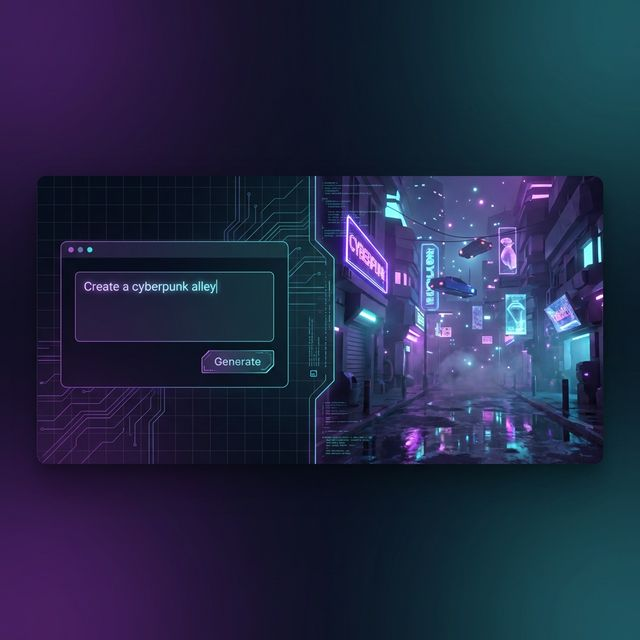
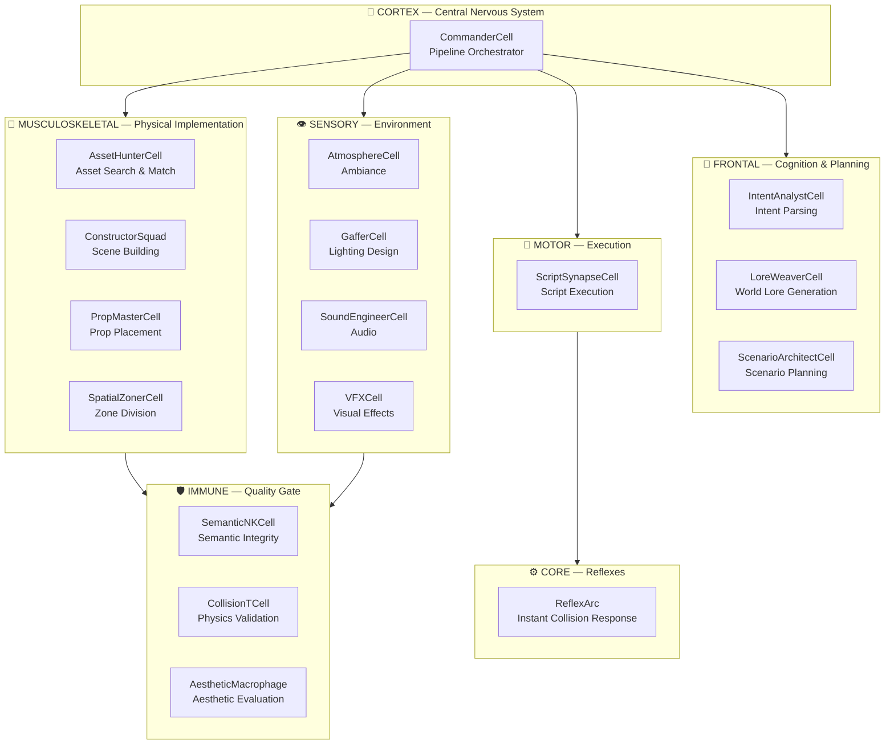
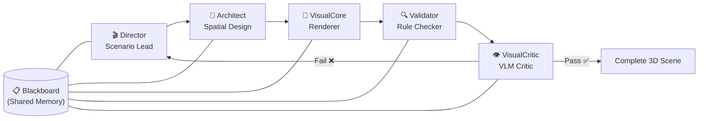
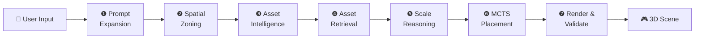

<p align="center">
  
</p>

<h1 align="center">🌍 WebPilot Engine</h1>

<p align="center">
  <strong>Create complete 3D worlds from a single line of text.</strong>
</p>

<p align="center">
  <em>"Create a magical forest"</em> → AI scenario design → asset retrieval → spatial placement → real-time 3D rendering
</p>

<p align="center">
  <a href="https://web-pilot-engine.vercel.app"></a>
  <a href="https://web-pilot-engine.vercel.app/reports"></a>
  
  
  
  
  <a href="./LICENSE"></a>
</p>

<p align="center">
  
</p>

<p align="center">
  <em>👆 "Create a cyberpunk alley" → AI analyzes the scenario and generates a 3D world in real-time</em>
</p>

<p align="center">
  <a href="./README.md">🇰🇷 한국어</a> · <strong>🇬🇧 English</strong>
</p>

---

## 🎯 Core Philosophy

WebPilot Engine replaces every limitation of traditional 3D scene creation with **AI reasoning**.

| Traditional Approach | WebPilot Approach |
|:---------------------|:------------------|
| ❌ Hardcoded placement rules | ✅ AI **dynamically generates** context-aware rules |
| ❌ Keyword-based asset search | ✅ Gemini Embedding-based **semantic vector search** |
| ❌ Uniform scaling for all objects | ✅ **Per-object AI reasoning** based on role & context |
| ❌ Manual coordinate assignment | ✅ MCTS energy function-based **optimal placement** + collision avoidance |

---

## 🧠 Architecture

### Bio-Inspired Cellular Architecture

Inspired by **biological neural systems**, WebPilot uses a **7-layer, 15-cell agent system** where each cell operates independently while collaborating organically — like neurons in a brain.



### Agent-to-Agent (A2A) Pipeline

Five specialized agents collaborate through a **Blackboard** (shared memory) and **ControlUnit** (orchestrator):



| Agent | Role | Key Capability |
|:------|:-----|:---------------|
| 🎬 **Director** | Scenario Lead | Reflexion pattern (draft → self-critique → refine → select) |
| 📐 **Architect** | Spatial Design | VectorSearch + MCTS energy function optimal placement |
| 🎨 **VisualCore** | Renderer | Matcap/NPR style + Three.js scene rendering |
| 🔍 **Validator** | Rule Checker | 6-Tier QualityGate (schema/physics/perf/aesthetics) |
| 👁️ **VisualCritic** | VLM Critic | Gemini Vision scene quality feedback loop |

---

## 🔧 7-Step AI Pipeline

From user prompt to complete 3D scene in **7 automated steps**:



| Step | Service | Description |
|:----:|:--------|:------------|
| ❶ | `PromptExpansionService` | Expands user input into detailed scene descriptions |
| ❷ | `SpatialZoningService` | Divides space into center/periphery/corner zones |
| ❸ | `AssetIntelligenceService` | Infers required assets (role/size/quantity/placement hints) |
| ❹ | `AssetRetrievalService` + `VectorSearchService` | Semantic vector search across 3,477 assets |
| ❺ | `ScaleReasoningService` + `SemanticScaleResolver` | Per-object AI scale reasoning |
| ❻ | `MCTSPlacementService` | Energy function-based optimal placement + BVH collision avoidance |
| ❼ | `RenderValidationService` + `VQALoop` | WebGL rendering + VLM quality verification loop |

---

## ⚙️ Core Systems

### 🧮 State Management — UnifiedStore (Zustand SSOT)

```
UnifiedStore (Slice Architecture)
├── WorldSlice        → Scene objects, camera, lighting
├── SimulationSlice   → GameTicker, NPC state, physics
├── EditorSlice       → UI state, prompts, loading
├── AudioStore        → BGM, SFX, Ambient control
└── ObjectStore       → Per-asset transform/metadata

🔄 Reactive State  → Zustand → UI re-renders (object lists, loading)
⚡ Transient State → Ref-based → 60fps loop (camera, tick counters)
```

### 📐 Spatial Intelligence

| System | Algorithm | Purpose |
|:-------|:----------|:--------|
| **MCTS** | Monte Carlo Tree Search + UCB1 | Energy function-based optimal placement (64KB service) |
| **Poisson Disk** | Blue noise sampling | Natural object distribution |
| **BVH + Spatial Hash** | Bounding Volume Hierarchy | O(log n) collision detection |
| **OBB** | 15-axis SAT (Separating Axis Theorem) | Rotated bounding box collision |
| **NavMesh** | A* pathfinding | Walkable area placement verification |
| **Raycasting** | Slabs Method | Container interior verification |

### 🔍 Resource & Asset System

| Service | Size | Function |
|:--------|:-----|:---------|
| `VectorSearchService` | 36KB | Gemini Embedding-based semantic vector search |
| `SemanticCacheService` | 18KB | Embedding reuse cache (deduplication) |
| `R2StorageService` | 13KB | Cloudflare R2 asset CDN |
| `MissingResourceTracker` | 15KB | Auto-tracks & reports unregistered assets |
| `AssetOrchestrator` | 14KB | Asset search/load orchestration |

### ✅ Quality & Validation

- **QualityGate**: 6-Tier validation — Scenario / Object / Placement / Performance / Navigation / Visual
- **LLM-as-Judge**: Gemini + Reflexion → automated quality scoring
- **Immune System**: SemanticNK (semantic) + CollisionT (physics) + AestheticMacrophage (aesthetics)

### 🌐 Extended Systems

| System | Module | Description |
|:-------|:-------|:------------|
| 📖 **Narrative** | `services/narrative/` | Story generation + branching narratives |
| 👤 **Persona** | `services/persona/` | NPC personas + LLM conversations |
| 💰 **Economy** | `services/economy/` | In-game economy simulation |
| 🌐 **Multiplayer** | `services/multiplayer/` | Real-time multiplayer sync |
| 🥽 **XR** | `services/xr/` | WebXR session management |
| ⛓️ **Web3** | `services/web3/` | Story Protocol + ERC-6551 |
| 🕸️ **Graph** | `services/graph/` | Neo4j knowledge graph integration |
| 🎰 **XState** | `machines/` | State machine-driven interactions |

---

## 📦 Asset Library — 3,477 Assets

| Type | Count | Source |
|:-----|------:|:-------|
| 3D Models (GLB) | 2,632 | SDXL + TripoSR (952 self-generated) + CC0 |
| BGM | 20 | ElevenLabs AI |
| SFX | 94 | Freesound CC0 + ElevenLabs |
| Ambient | 114 | Freesound CC0 |
| Skybox | 60 | Blockade Labs + Poly Haven |
| HDRI | 30 | Poly Haven CC0 |
| PBR Textures | 334 | Kenney + Poly Haven CC0 |
| Particles | 193 | Kenney CC0 |

> 📊 29 categories · Full audit 0% corruption rate · 83% seal rate

---

## 🛠️ Tech Stack

| Layer | Technology |
|:------|:-----------|
| **Framework** | Next.js 14 (App Router) |
| **3D Engine** | Three.js 0.170 / React Three Fiber 8 |
| **AI Model** | Gemini 2.0 Flash / Pro |
| **Embeddings** | gemini-embedding-001 |
| **State** | Zustand (UnifiedStore, Slice Pattern) |
| **State Machines** | XState 5 |
| **Spatial** | MCTS + BVH + Poisson Disk Sampling |
| **Styling** | TailwindCSS 3 |
| **Validation** | Zod (Runtime Schema) |
| **Storage** | Cloudflare R2 |
| **Deploy** | Vercel |
| **Asset VCS** | Git LFS (*.glb) |

---

## 🚀 Getting Started

```bash
# 1. Clone (with LFS)
git lfs install
git clone https://github.com/yesol/webpilot-engine.git

# 2. Install dependencies
cd webpilot-engine
npm install

# 3. Configure environment
cp .env.example .env.local
# Set GEMINI_API_KEY=your_gemini_api_key

# 4. Run dev server
npm run dev
# → http://localhost:3000
```

---

## 📂 Project Structure

```
src/
├── cells/                       # 🧠 Bio-Inspired Cell Architecture (7 layers · 15 cells)
│   ├── core/                    #   ReflexArc — instant collision response
│   ├── cortex/                  #   CommanderCell — pipeline orchestration
│   ├── frontal/                 #   IntentAnalyst · LoreWeaver · ScenarioArchitect
│   ├── immune/                  #   SemanticNK · CollisionT · AestheticMacrophage
│   ├── motor/                   #   ScriptSynapseCell — script execution
│   ├── sensory/                 #   Atmosphere · Gaffer · SoundEngineer · VFX
│   └── musculoskeletal/         #   AssetHunter · ConstructorSquad · PropMaster · SpatialZoner
│
├── services/                    # Business logic (35 root services + 18 sub-modules)
│   ├── a2a/                     #   🤖 Director · Architect · VisualCore · Validator · Critic
│   ├── ai-pipeline/             #   🔧 7-Step pipeline services (18)
│   ├── quality/                 #   ✅ QualityGate 6-Tier validation
│   ├── search/                  #   🔍 Semantic vector search
│   ├── spatial/                 #   📐 Spatial computation (BVH, NavMesh)
│   ├── validators/              #   ✔️ 6 validators
│   ├── graph/                   #   🕸️ Neo4j knowledge graph
│   ├── narrative/               #   📖 Narrative engine
│   ├── persona/                 #   👤 NPC persona system
│   ├── economy/                 #   💰 Economy simulation
│   ├── multiplayer/             #   🌐 Multiplayer
│   ├── xr/                      #   🥽 WebXR
│   ├── web3/                    #   ⛓️ Story Protocol / ERC-6551
│   ├── judge/                   #   ⚖️ LLM-as-Judge
│   ├── cache/                   #   💾 Semantic Cache
│   ├── generation/              #   🏗️ Asset generation (Tripo/Meshy)
│   ├── world/                   #   🌍 World management
│   ├── VectorSearchService.ts   #   ⭐ Semantic vector search (36KB)
│   └── SemanticCacheService.ts  #   ⭐ Embedding cache (18KB)
│
├── store/                       # 💾 UnifiedStore — Zustand SSOT (Slice Pattern)
├── machines/                    # 🎰 XState state machines
├── workers/                     # ⚡ Web Workers (parallel MCTS)
├── components/                  # 🎮 React + R3F components (17 modules)
│   ├── 3d/ canvas/ scene/       #   3D rendering
│   ├── effects/ splats/         #   Post-processing · 3DGS
│   ├── game/ interaction/       #   Game UI · Interaction
│   ├── studio/ generative-ui/   #   Editor · AI-generated UI
│   ├── landing/ onboarding/     #   Landing · Onboarding
│   └── audio/ debug/ ui/        #   Audio · Debug · Common UI
├── lib/                         # 📚 Utilities (Schema · Geometry · API)
├── app/                         # 📄 Next.js App Router (11 routes)
├── hooks/                       # 🪝 Custom hooks
├── types/                       # 📋 TypeScript type definitions
├── data/                        # 📊 Static data (AssetRegistry)
└── config/                      # ⚙️ Configuration

public/
├── models/                      # 2,632 GLB (Git LFS · 29 categories)
│   ├── generated/               #   952 — SDXL+TripoSR self-generated
│   ├── Kenney/                  #   800 — CC0
│   ├── PolyPizza/               #   600 — CC licensed
│   └── Quaternius/              #   200 — CC0
├── sounds/                      # 228 (BGM · SFX · Ambient)
├── skybox/                      # 90 (Skybox · HDRI)
└── textures/                    # 527 (PBR · Particles)
```

---

## 📚 Documentation

Full technical documentation is available in [`docs/`](./docs/) (Korean):

| Doc | Content |
|:----|:--------|
| [01. Project Overview](./docs/01_PROJECT_OVERVIEW.md) | Mission · Tech stack · Cell architecture |
| [02. System Architecture](./docs/02_ARCHITECTURE.md) | Cell + A2A + Director-Architect-Renderer |
| [03. AI Pipeline](./docs/03_AI_PIPELINE.md) | 7-Step pipeline + 18 service details |
| [04. Geometry Systems](./docs/04_GEOMETRY_SYSTEMS.md) | OBB · NavMesh · Raycasting · BVH |
| [05. Scaling Policy](./docs/05_SCALING_POLICY.md) | SEMANTIC_ALPHA_TABLE |
| [06. Asset Management](./docs/06_ASSET_MANAGEMENT.md) | 3,477 assets + Vector search |
| [08. Code Structure](./docs/08_CODE_STRUCTURE.md) | Module dependency graph |

---

<p align="center">
  <strong>🤖 All architecture, core logic, AI pipeline, and asset generation pipeline<br/>
  were built with <a href="https://cloud.google.com/">Google Antigravity Development Agent</a>.</strong>
</p>

<p align="center">
  <a href="./LICENSE">MIT License</a> · © 2025-2026 Yesol Heo
</p>
