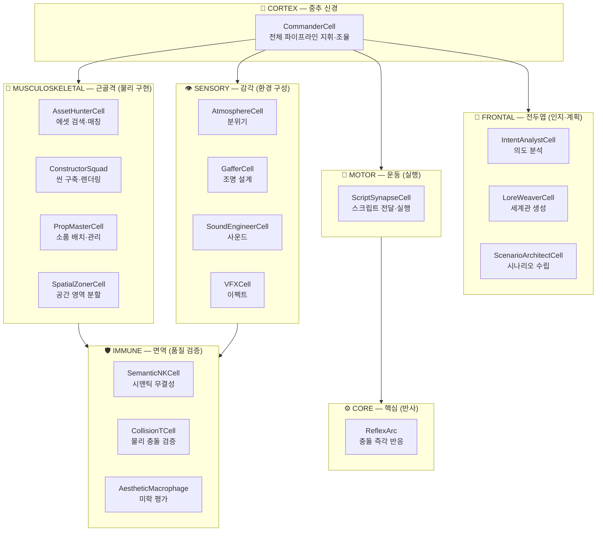
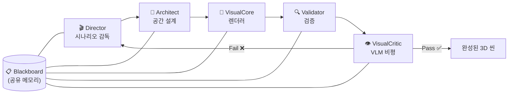
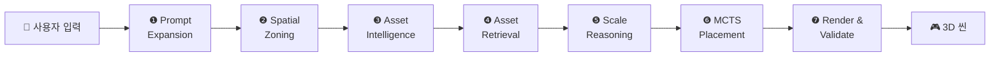

<p align="center">
  
</p>

<h1 align="center">🌍 WebPilot Engine</h1>

<p align="center">
  <strong>텍스트 한 줄로 완전한 3D 세계를 창조하는 AI-Native World Generator</strong>
</p>

<p align="center">
  <em>"마법의 숲을 만들어줘"</em> → AI 시나리오 구상 → 에셋 검색 → 공간 배치 → 실시간 3D 렌더링
</p>

<p align="center">
  <a href="https://web-pilot-engine.vercel.app"></a>
  <a href="https://web-pilot-engine.vercel.app/reports"></a>
  
  
  
  
  <a href="./LICENSE"></a>
</p>

<p align="center">
  
</p>

<p align="center">
  <em>👆 "Create a cyberpunk alley" → AI가 시나리오를 분석하고 3D 월드를 실시간 생성</em>
</p>

<p align="center">
  <strong>🇰🇷 한국어</strong> · <a href="./README.en.md">🇬🇧 English</a>
</p>

---

## 🎯 핵심 철학

WebPilot Engine은 기존 3D 씬 생성 방식의 모든 한계를 **AI 추론**으로 대체합니다.

| 기존 방식 | WebPilot 방식 |
|:----------|:-------------|
| ❌ 하드코딩된 배치 규칙 | ✅ AI가 문맥에 맞는 규칙을 **동적 생성** |
| ❌ 키워드 매칭 에셋 검색 | ✅ Gemini Embedding 기반 **시맨틱 벡터 검색** |
| ❌ 모든 오브젝트 동일 스케일 | ✅ 각 오브젝트의 역할/맥락을 이해한 **개별 AI 추론** |
| ❌ 좌표 수동 지정 | ✅ MCTS 에너지 함수 기반 **최적 배치** + 충돌 회피 |

---

## 🧠 아키텍처

### Bio-Inspired 셀 아키텍처

생물학적 신경계에서 영감을 받은 **7계층 · 15셀 시스템**. 각 셀이 독립적으로 기능하면서도 유기적으로 협력합니다.



### Agent-to-Agent (A2A) 파이프라인

5개의 전문 에이전트가 **Blackboard** (공유 메모리) + **ControlUnit** (조율자)으로 협업합니다.



| 에이전트 | 역할 | 핵심 기능 |
|:---------|:-----|:----------|
| 🎬 **Director** | 시나리오 감독 | Reflexion 패턴 (초안 → 자기비평 → 개선안 → 선택) |
| 📐 **Architect** | 공간 설계 | VectorSearch + MCTS 에너지 함수 최적 배치 |
| 🎨 **VisualCore** | 렌더러 | Matcap/NPR 스타일 + Three.js 씬 렌더링 |
| 🔍 **Validator** | 규칙 검증 | 6-Tier QualityGate (스키마/물리/성능/미학) |
| 👁️ **VisualCritic** | VLM 비평 | Gemini Vision 장면 품질 피드백 루프 |

---

## 🔧 7-Step AI 파이프라인

사용자 프롬프트 → 완성된 3D 씬까지 **7단계 자동 처리**:



| 단계 | 서비스 | 설명 |
|:----:|:-------|:-----|
| ❶ | `PromptExpansionService` | 사용자 입력을 세분화된 씬 설명으로 확장 |
| ❷ | `SpatialZoningService` | 공간을 중앙/주변/코너 영역으로 분할 |
| ❸ | `AssetIntelligenceService` | 필요 에셋 추론 (역할/크기/수량/위치 힌트) |
| ❹ | `AssetRetrievalService` + `VectorSearchService` | 3,477개 에셋에서 시맨틱 벡터 검색 |
| ❺ | `ScaleReasoningService` + `SemanticScaleResolver` | 오브젝트별 개별 스케일 AI 추론 |
| ❻ | `MCTSPlacementService` | 에너지 함수 기반 최적 배치 + BVH 충돌 회피 |
| ❼ | `RenderValidationService` + `VQALoop` | WebGL 렌더링 + VLM 품질 검증 루프 |

---

## ⚙️ 핵심 시스템

### 🧮 상태 관리 — UnifiedStore (Zustand SSOT)

```
UnifiedStore (Slice Architecture)
├── WorldSlice        → 씬 오브젝트, 카메라, 조명
├── SimulationSlice   → GameTicker, NPC 상태, 물리
├── EditorSlice       → UI 상태, 프롬프트, 로딩
├── AudioStore        → BGM, SFX, Ambient 제어
└── ObjectStore       → 에셋별 트랜스폼/메타데이터

🔄 Reactive State  → Zustand → UI 리렌더링 (오브젝트 목록, 로딩)
⚡ Transient State → Ref 기반 → 60fps 루프 (카메라, 틱 카운터)
```

### 📐 공간 지능 시스템

| 시스템 | 알고리즘 | 용도 |
|:-------|:---------|:-----|
| **MCTS** | Monte Carlo Tree Search + UCB1 | 에너지 함수 기반 최적 배치 (64KB 서비스) |
| **Poisson Disk** | 블루 노이즈 샘플링 | 자연스러운 오브젝트 분포 생성 |
| **BVH + Spatial Hash** | Bounding Volume Hierarchy | O(log n) 충돌 감지 |
| **OBB** | 15축 SAT (Separating Axis Theorem) | 회전된 바운딩 박스 충돌 판정 |
| **NavMesh** | A* 경로 탐색 | 보행 가능 영역 배치 검증 |
| **Raycasting** | Slabs Method | 컨테이너 내부 배치 검증 |

### 🔍 리소스 & 에셋 시스템

| 서비스 | 크기 | 기능 |
|:-------|:-----|:-----|
| `VectorSearchService` | 36KB | Gemini Embedding 기반 시맨틱 벡터 검색 |
| `SemanticCacheService` | 18KB | 임베딩 재사용 캐시 (중복 방지) |
| `R2StorageService` | 13KB | Cloudflare R2 에셋 CDN |
| `MissingResourceTracker` | 15KB | 미등록 에셋 추적 + 자동 보고 |
| `AssetOrchestrator` | 14KB | 에셋 검색/로딩 오케스트레이션 |

### ✅ 품질 검증 체계

- **QualityGate**: 6-Tier 검증 — Scenario / Object / Placement / Performance / Navigation / Visual
- **LLM-as-Judge**: Gemini + Reflexion → 자동 품질 평가 + 점수 산출
- **Immune System**: SemanticNK (시맨틱) + CollisionT (물리) + AestheticMacrophage (미학)

### 🌐 확장 시스템

| 시스템 | 모듈 | 설명 |
|:-------|:-----|:-----|
| 📖 **Narrative** | `services/narrative/` | 스토리 생성 + 내러티브 분기 |
| 👤 **Persona** | `services/persona/` | NPC 페르소나 + LLM 대화 |
| 💰 **Economy** | `services/economy/` | 인게임 경제 시뮬레이션 |
| 🌐 **Multiplayer** | `services/multiplayer/` | 실시간 멀티플레이어 동기화 |
| 🥽 **XR** | `services/xr/` | WebXR 세션 관리 |
| ⛓️ **Web3** | `services/web3/` | Story Protocol + ERC-6551 |
| 🕸️ **Graph** | `services/graph/` | Neo4j 지식 그래프 통합 |
| 🎰 **XState** | `machines/` | 상태 머신 기반 인터랙션 로직 |

---

## 📦 에셋 라이브러리 — 3,477개

| 유형 | 수량 | 출처 |
|:-----|-----:|:-----|
| 3D 모델 (GLB) | 2,632 | SDXL + TripoSR (자체 생성 952) + CC0 |
| BGM | 20 | ElevenLabs AI |
| SFX | 94 | Freesound CC0 + ElevenLabs |
| Ambient | 114 | Freesound CC0 |
| Skybox | 60 | Blockade Labs + Poly Haven |
| HDRI | 30 | Poly Haven CC0 |
| PBR 텍스처 | 334 | Kenney + Poly Haven CC0 |
| 파티클 | 193 | Kenney CC0 |

> 📊 29개 카테고리 · 전수 감사 손상률 0% · 밀봉률 83%

---

## 🛠️ 기술 스택

| 계층 | 기술 |
|:-----|:-----|
| **프레임워크** | Next.js 14 (App Router) |
| **3D 엔진** | Three.js 0.170 / React Three Fiber 8 |
| **AI 모델** | Gemini 2.0 Flash / Pro |
| **임베딩** | gemini-embedding-001 |
| **상태 관리** | Zustand (UnifiedStore, Slice Pattern) |
| **상태 머신** | XState 5 |
| **공간 연산** | MCTS + BVH + Poisson Disk Sampling |
| **스타일링** | TailwindCSS 3 |
| **런타임 검증** | Zod (Schema Validation) |
| **스토리지** | Cloudflare R2 |
| **배포** | Vercel |
| **에셋 VCS** | Git LFS (*.glb) |

---

## 🚀 시작하기

```bash
# 1. 저장소 클론 (LFS 포함)
git lfs install
git clone https://github.com/yesol/webpilot-engine.git

# 2. 의존성 설치
cd webpilot-engine
npm install

# 3. 환경 변수 설정
cp .env.example .env.local
# GEMINI_API_KEY=your_gemini_api_key 입력

# 4. 개발 서버 실행
npm run dev
# → http://localhost:3000
```

---

## 📂 프로젝트 구조

```
src/
├── cells/                       # 🧠 Bio-Inspired 셀 아키텍처 (7계층 · 15셀)
│   ├── core/                    #   ReflexArc — 충돌 즉각 반응
│   ├── cortex/                  #   CommanderCell — 전체 파이프라인 지휘/조율
│   ├── frontal/                 #   IntentAnalyst · LoreWeaver · ScenarioArchitect
│   ├── immune/                  #   SemanticNK · CollisionT · AestheticMacrophage
│   ├── motor/                   #   ScriptSynapseCell — 스크립트 실행
│   ├── sensory/                 #   Atmosphere · Gaffer · SoundEngineer · VFX
│   └── musculoskeletal/         #   AssetHunter · ConstructorSquad · PropMaster · SpatialZoner
│
├── services/                    # 비즈니스 로직 (35개 루트 서비스 + 18개 서브 모듈)
│   ├── a2a/                     #   🤖 Director · Architect · VisualCore · Validator · Critic
│   ├── ai-pipeline/             #   🔧 7-Step 파이프라인 서비스 (18개)
│   ├── quality/                 #   ✅ QualityGate 6-Tier 검증
│   ├── search/                  #   🔍 시맨틱 벡터 검색
│   ├── spatial/                 #   📐 공간 계산 (BVH, NavMesh)
│   ├── validators/              #   ✔️ 6종 검증기
│   ├── graph/                   #   🕸️ Neo4j 지식 그래프
│   ├── narrative/               #   📖 내러티브 엔진
│   ├── persona/                 #   👤 NPC 페르소나
│   ├── economy/                 #   💰 경제 시뮬레이션
│   ├── multiplayer/             #   🌐 멀티플레이어
│   ├── xr/                      #   🥽 WebXR
│   ├── web3/                    #   ⛓️ Story Protocol / ERC-6551
│   ├── judge/                   #   ⚖️ LLM-as-Judge
│   ├── cache/                   #   💾 Semantic Cache
│   ├── generation/              #   🏗️ 에셋 생성 (Tripo/Meshy)
│   ├── world/                   #   🌍 월드 관리
│   ├── VectorSearchService.ts   #   ⭐ 시맨틱 벡터 검색 (36KB)
│   └── SemanticCacheService.ts  #   ⭐ 임베딩 캐시 (18KB)
│
├── store/                       # 💾 UnifiedStore — Zustand SSOT (Slice Pattern)
├── machines/                    # 🎰 XState 상태 머신
├── workers/                     # ⚡ Web Workers (MCTS 병렬 연산)
├── components/                  # 🎮 React + R3F 컴포넌트 (17 모듈)
│   ├── 3d/ canvas/ scene/       #   3D 렌더링
│   ├── effects/ splats/         #   포스트 프로세싱 · 3DGS
│   ├── game/ interaction/       #   게임 UI · 인터랙션
│   ├── studio/ generative-ui/   #   에디터 · AI 생성 UI
│   ├── landing/ onboarding/     #   랜딩 · 온보딩
│   └── audio/ debug/ ui/        #   오디오 · 디버그 · 공용 UI
├── lib/                         # 📚 유틸리티 (Schema · Geometry · API)
├── app/                         # 📄 Next.js App Router (11 라우트)
├── hooks/                       # 🪝 커스텀 훅
├── types/                       # 📋 TypeScript 타입 정의
├── data/                        # 📊 정적 데이터 (AssetRegistry)
└── config/                      # ⚙️ 설정

public/
├── models/                      # 2,632 GLB (Git LFS · 29 카테고리)
│   ├── generated/               #   952개 — SDXL+TripoSR 자체 생성
│   ├── Kenney/                  #   800개 — CC0
│   ├── PolyPizza/               #   600개 — CC 인증
│   └── Quaternius/              #   200개 — CC0
├── sounds/                      # 228개 (BGM · SFX · Ambient)
├── skybox/                      # 90개 (Skybox · HDRI)
└── textures/                    # 527개 (PBR · 파티클)
```

---

## 📚 기술 문서

전체 기술 문서는 [`docs/`](./docs/) 디렉토리에 있습니다.

| 문서 | 내용 |
|:-----|:-----|
| [01. 프로젝트 개요](./docs/01_PROJECT_OVERVIEW.md) | 미션 · 기술 스택 · 셀 아키텍처 |
| [02. 시스템 아키텍처](./docs/02_ARCHITECTURE.md) | 셀 + A2A + Director-Architect-Renderer |
| [03. AI 파이프라인](./docs/03_AI_PIPELINE.md) | 7-Step 파이프라인 + 18개 서비스 상세 |
| [04. 기하학적 시스템](./docs/04_GEOMETRY_SYSTEMS.md) | OBB · NavMesh · Raycasting · BVH |
| [05. 스케일링 정책](./docs/05_SCALING_POLICY.md) | SEMANTIC_ALPHA_TABLE |
| [06. 에셋 관리](./docs/06_ASSET_MANAGEMENT.md) | 3,477 에셋 + 벡터 검색 |
| [07. 사용자 흐름](./docs/07_USER_FLOW.md) | UX 시나리오 |
| [08. 코드 구조](./docs/08_CODE_STRUCTURE.md) | 모듈 의존성 그래프 |
| [09. 배포 운영](./docs/09_DEPLOYMENT.md) | Vercel 배포 가이드 |
| [10. API 레퍼런스](./docs/10_API_REFERENCE.md) | 함수 명세 |

---

<p align="center">
  <strong>🤖 본 엔진의 모든 아키텍처, 코어 로직, AI 파이프라인, 에셋 생성 파이프라인은<br/>
  <a href="https://cloud.google.com/">Google Antigravity Development Agent</a>에 의해 작성되었습니다.</strong>
</p>

<p align="center">
  <a href="./LICENSE">MIT License</a> · © 2025-2026 Yesol Heo
</p>
