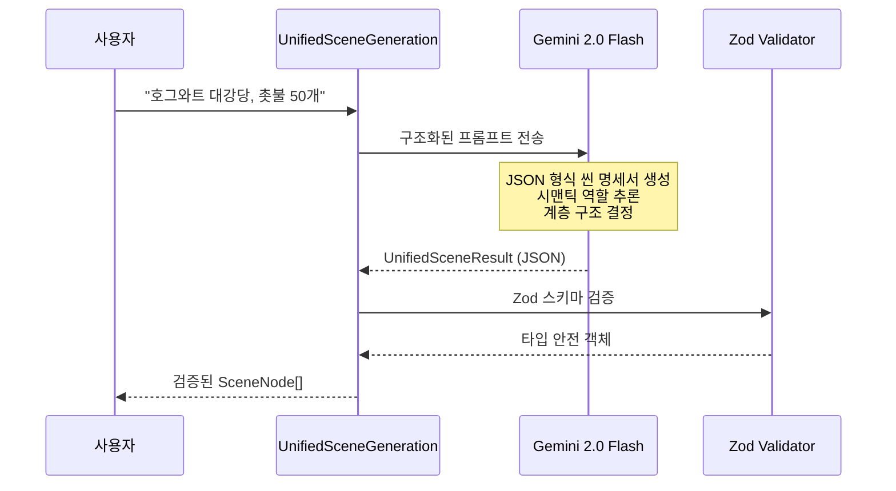
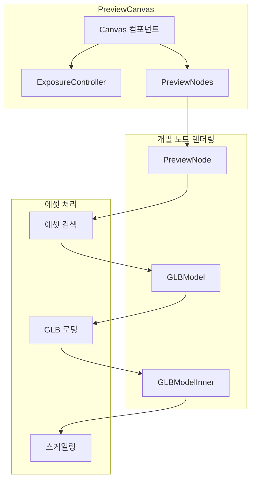

# 📐 02. 시스템 아키텍처

> **Bio-Inspired 셀 아키텍처 + A2A 에이전트 + Director-Architect-Renderer Triad**  
> **최종 업데이트**: 2026-02-12

---

## 🎯 아키텍처 개요

WebPilot Engine은 **생물학적 신경계**에서 영감을 받은 **Bio-Inspired 셀 아키텍처**와 **A2A 에이전트 파이프라인**을 결합한 3단 파이프라인 아키텍처를 사용합니다.

---

## 🧠 셀 아키텍처 (Bio-Inspired Cellular Architecture)

각 셀이 독립적으로 기능하면서 유기적으로 협력하는 7계층 단치 구조:

```
┌─────────────────────────────────────────────────────────────────┐
│                    🧠 Cortex (중추 신경)                         │
│                   CommanderCell (지휘/조율)                      │
├─────────────────────────────────────────────────────────────────┤
│  🔮 Frontal (전두엽)              🛡️ Immune (면역)              │
│  ├─ IntentAnalystCell              ├─ SemanticNKCell             │
│  ├─ LoreWeaverCell                 ├─ CollisionTCell             │
│  └─ ScenarioArchitectCell          └─ AestheticMacrophage        │
│                                                                  │
│  🦴 Musculoskeletal (근골격)        👁️ Sensory (감각)              │
│  ├─ AssetHunterCell (24KB)          ├─ AtmosphereCell             │
│  ├─ ConstructorSquad (20KB)         ├─ GafferCell                 │
│  ├─ PropMasterCell (11KB)           ├─ SoundEngineerCell          │
│  └─ SpatialZonerCell (15KB)         └─ VFXCell                    │
│                                                                  │
│  🏃 Motor (운동)                   ⚙️ Core (한심)                │
│  └─ ScriptSynapseCell              └─ ReflexArc (충돌 즉각 반응)   │
└─────────────────────────────────────────────────────────────────┘
```

---

## 🤖 A2A 에이전트 시스템

| 에이전트 | 역할 | 핵심 기능 |
|:---------|:-----|:---------|
| 🎬 Director | 시나리오 감독 | Reflexion 패턴 (초안 → 자기비평 → 개선) |
| 📐 Architect | 공간 설계 | VectorSearch + MCTS 에너지 함수 최적 배치 |
| 🎨 VisualCore | 렌더러 | Matcap/NPR 스타일 + 씨잔 렌더링 |
| 🔍 Validator | 규칙 검증 | 6-Tier QualityGate (스키마/물리/성능/미학) |
| 👁️ VisualCritic | VLM 비평 | Gemini Vision 장면 품질 피드백 루프 |

에이전트 간 통신: **Blackboard** (공유 메모리) + **ControlUnit** (조율자) + **AgentMessageBus** (메시지 버스)

```
┌─────────────────────────────────────────────────────────────────┐
│                    WebPilot Engine Pipeline                       │
├────────────────┬────────────────────┬─────────────────────────────┤
│   🎬 Director   │   📐 Architect     │   🎨 Renderer               │
│                │                    │                             │
│  "무엇을"       │  "어디에"           │  "어떻게"                    │
│  창조할지       │  배치할지           │  보여줄지                    │
│                │                    │                             │
│  Gemini AI     │  MCTS Solver       │  Three.js                   │
│  씬 명세서      │  좌표 계산          │  3D 렌더링                   │
└────────────────┴────────────────────┴─────────────────────────────┘
```

---

## 🎬 Stage 1: Director (AI 추론)

**책임**: 사용자 프롬프트를 분석하여 씬 명세서(Scene Specification)를 생성합니다.

### 파일 위치

```
src/services/ai-pipeline/UnifiedSceneGenerationService.ts (384줄)
```

### 핵심 처리 과정



### 생성되는 데이터 구조

```typescript
// src/services/ai-pipeline/UnifiedSceneGenerationService.ts

interface UnifiedSceneNode {
    id: string;                    // 고유 ID (예: "candle_01")
    name: string;                  // 표시 이름 (예: "떠다니는 촛불")
    description: string;           // 에셋 검색용 설명
    
    // 시맨틱 정보
    semanticRole: SemanticRole;    // 'decoration_floating'
    keywords: string[];            // ['candle', 'floating', 'magic']
    
    // 계층 구조
    parentId: string | null;       // 부모 컨테이너 ID
    isContainer: boolean;          // 자식 포함 가능 여부
    
    // 공간 관계
    relationships: {
        targetId: string;
        type: 'inside' | 'on_top_of' | 'next_to' | 'floating' | 'hanging';
    }[];
    
    // 배치 힌트 (Architect가 사용)
    placementHint?: {
        floatingRange?: [number, number];  // [minY, maxY]
        attachTo?: 'floor' | 'ceiling' | 'wall';
        preferredHeight?: number;
        zone?: 'center' | 'near_wall' | 'corner' | 'random';
    };
    
    // 스케일
    suggestedScale: number;        // 미터 단위 (예: 0.18)
    count: number;                 // 생성 개수 (예: 50)
}

interface UnifiedSceneResult {
    sceneId: string;
    title: string;
    theme: string;
    mainContainer: UnifiedSceneNode | null;
    nodes: UnifiedSceneNode[];
    metadata: {
        prompt: string;
        inferenceMethod: 'ai_unified' | 'fallback_inference';
        processingTimeMs: number;
        nodeCount: number;
        containerCount: number;
    };
}
```

### Gemini 프롬프트 템플릿

```typescript
// 실제 사용되는 프롬프트 구조
const SYSTEM_PROMPT = `
당신은 3D 씬 구조 전문가입니다.
사용자의 설명을 분석하여 다음을 생성하세요:

1. 메인 컨테이너 (건물, 방 등 환경)
2. 모든 오브젝트의 시맨틱 역할
3. 계층적 부모-자식 관계
4. 공간적 배치 힌트

출력은 반드시 다음 JSON 형식을 따르세요:
${JSON.stringify(UnifiedSceneResultSchema)}
`;
```

---

## 📐 Stage 2: Architect (배치 최적화)

**책임**: 씬 명세서를 받아 충돌 없는 최적의 좌표를 계산합니다.

### 파일 위치

```
src/services/ai-pipeline/MCTSPlacementService.ts (832줄)
```

### MCTS (Monte Carlo Tree Search) 알고리즘

```
                    ┌─────────────────┐
                    │   Selection     │
                    │  (최고 점수 선택) │
                    └────────┬────────┘
                             │
              ┌──────────────▼──────────────┐
              │        Expansion            │
              │  (후보 위치 8개 샘플링)       │
              └──────────────┬──────────────┘
                             │
              ┌──────────────▼──────────────┐
              │       Simulation            │
              │  (충돌 검사 + 점수 계산)      │
              └──────────────┬──────────────┘
                             │
              ┌──────────────▼──────────────┐
              │    Backpropagation          │
              │  (최적 위치 선택/업데이트)    │
              └─────────────────────────────┘
```

### 핵심 함수

```typescript
// MCTSPlacementService.ts

export const MCTSPlacementService = {
    /**
     * 전체 배치 실행
     * @param layout - 공간 레이아웃 (Zone 정보)
     * @param retrievalResult - 매칭된 에셋 목록
     * @param scaleOutput - 스케일 정보
     */
    async place(
        layout: SpatialLayout,
        retrievalResult: AssetRetrievalResult,
        scaleOutput: ScaleReasoningOutput
    ): Promise<PlacementResult>

    /**
     * BVH 가속 MCTS 탐색
     * 50회 반복으로 최적 위치 탐색
     */
    findOptimalPositionBVH(
        asset: RetrievedAsset,
        zone: Zone,
        scale: [number, number, number],
        bvhManager: DynamicBVHManager
    ): OptimalPosition

    /**
     * 배치 점수 계산
     * - 충돌: -1000점
     * - 중앙 근접: +50점
     * - 바닥 접촉: +30점
     */
    calculateScoreBVH(
        position: [number, number, number],
        scale: [number, number, number],
        zone: Zone,
        bvhManager: DynamicBVHManager
    ): number
}
```

### BVH (Bounding Volume Hierarchy) 가속

```typescript
// 동적 BVH 관리자
class DynamicBVHManager {
    private primitives: Primitive[] = [];
    private bvh: BVHTree;
    
    // 오브젝트 추가 시 BVH 자동 업데이트
    addObject(id: string, position: [x, y, z], scale: [w, h, d]): void
    
    // O(log n) 충돌 검사
    checkCollision(position: [x, y, z], scale: [w, h, d]): boolean
    
    // 배치 가능 여부 확인
    canPlaceObject(position: [x, y, z], scale: [w, h, d]): boolean
}
```

### 기하학 시스템 통합

```
MCTSPlacementService
    │
    ├── OBBCollisionSystem          [Phase B]
    │   └── 15축 SAT 정밀 충돌 검사
    │
    ├── NavMeshPlacementSystem      [Phase C]
    │   └── 보행 가능 영역 분석
    │
    ├── RaycastingContainerSystem   [Phase D]
    │   └── 컨테이너 경계 감지
    │
    └── DynamicBVHManager
        └── O(log n) 충돌 쿼리 가속
```

---

## 🎨 Stage 3: Renderer (3D 렌더링)

**책임**: 배치된 노드를 실제 3D 그래픽으로 렌더링합니다.

### 파일 위치

```
src/components/studio/PreviewCanvas.tsx (712줄)
```

### 렌더링 파이프라인



### 핵심 컴포넌트

```typescript
// PreviewCanvas.tsx

// 1. 메인 캔버스
export default function PreviewCanvas({
    nodes,          // SceneNode[]
    isGenerating,   // 로딩 상태
    isEmpty,        // 빈 씬 여부
    prompt          // 원본 프롬프트
}: PreviewCanvasProps)

// 2. 노드 렌더링
function PreviewNodes({ nodes, prompt }) {
    // 환경 에셋 매칭
    // 모든 노드 렌더링
    return (
        <group>
            <Grid infiniteGrid />
            {directEnvironmentMatch && <GLBModel ... />}
            {nodes.map(node => <PreviewNode node={node} />)}
        </group>
    );
}

// 3. GLB 모델 로딩 + 자동 스케일링
function GLBModelInner({ path, position, rotation, scale }) {
    const gltf = useGLTF(path);
    
    // [Phase E] 시맨틱 스케일링
    const normalizedScale = useMemo(() => {
        const result = autoScaleAssetSync(scene, path);
        return [
            scale[0] * result.scaleFactor,
            scale[1] * result.scaleFactor,
            scale[2] * result.scaleFactor
        ];
    }, [scene, scale, path]);
    
    return <primitive object={clonedScene} scale={normalizedScale} />;
}
```

### 3D 렌더링 설정

```typescript
// Canvas 설정
<Canvas
    gl={{
        antialias: true,
        toneMapping: THREE.ACESFilmicToneMapping,
        toneMappingExposure: 1.0,
    }}
    camera={{
        position: [15, 12, 15],
        fov: 60,
        near: 0.1,
        far: 1000,
    }}
    shadows
>
    <ambientLight intensity={0.4} />
    <directionalLight position={[10, 20, 10]} intensity={1.5} castShadow />
    <Environment preset="sunset" />
    <OrbitControls />
</Canvas>
```

---

## 🔗 전체 데이터 흐름

```
┌─────────────────┐
│  사용자 입력     │  "호그와트 대강당, 떠다니는 촛불 50개"
└────────┬────────┘
         │
         ▼
┌─────────────────────────────────────────────────────────────┐
│                    🎬 Director Stage                          │
│  ┌──────────────────┐    ┌──────────────────┐                │
│  │ UnifiedSceneGen  │───▶│  Gemini 2.0      │                │
│  │ Service          │◀───│  Flash API       │                │
│  └──────────────────┘    └──────────────────┘                │
│          │                                                    │
│          ▼                                                    │
│  ┌──────────────────────────────────────────┐                │
│  │ UnifiedSceneResult                       │                │
│  │ - mainContainer: 호그와트 대강당         │                │
│  │ - nodes: [촛불 x 50, 테이블 x 4]         │                │
│  │ - relationships, placementHints          │                │
│  └──────────────────────────────────────────┘                │
└─────────────────────────────────────────────────────────────┘
         │
         ▼
┌─────────────────────────────────────────────────────────────┐
│                    📐 Architect Stage                         │
│  ┌──────────────────┐    ┌──────────────────┐                │
│  │ MCTS Placement   │───▶│  BVH Manager     │                │
│  │ Service          │◀───│  충돌 쿼리        │                │
│  └──────────────────┘    └──────────────────┘                │
│          │                        │                           │
│          ▼                        ▼                           │
│  ┌───────────────────────────────────────────┐               │
│  │ PlacementResult                           │               │
│  │ - objects: [{id, position, rotation, scale}]              │
│  │ - stats: {collisions_resolved: 12}        │               │
│  └───────────────────────────────────────────┘               │
└─────────────────────────────────────────────────────────────┘
         │
         ▼
┌─────────────────────────────────────────────────────────────┐
│                    🎨 Renderer Stage                          │
│  ┌──────────────────┐    ┌──────────────────┐                │
│  │  PreviewCanvas   │───▶│  AssetRegistry   │                │
│  │                  │◀───│  에셋 매칭        │                │
│  └──────────────────┘    └──────────────────┘                │
│          │                                                    │
│          ▼                                                    │
│  ┌──────────────────┐                                        │
│  │  Three.js Scene  │  ───▶  WebGL 렌더링                     │
│  └──────────────────┘                                        │
└─────────────────────────────────────────────────────────────┘
```

---

## 📊 상태 관리 아키텍처

### Zustand UnifiedStore (슬라이스 패턴)

```typescript
// src/store/unifiedStore.ts — SSOT (Single Source of Truth)

// UnifiedStore: 슬라이스 패턴으로 분리된 상태 관리
const useUnifiedStore = create((...) => ({
    // WorldSlice: 씨 오브젝트, 카메라, 조명
    // SimulationSlice: GameTicker, NPC 상태, 물리
    // EditorSlice: UI 상태, 프롬프트, 로딩
    // AudioSlice: BGM, SFX, Ambient
    // ObjectSlice: 에셋별 트랜스폼/메타데이터
}));

// Reactive State: Zustand → UI 리렌더링 (오브젝트 목록, 로딩)
// Transient State: Ref 기반 → 60fps 루프 (카메라, 틱 카운터)
```

### XState 상태 머신

```typescript
// src/machines/interactionMachine.ts

const interactionMachine = createMachine({
    id: 'interaction',
    initial: 'idle',
    states: {
        idle: {
            on: {
                START_GENERATION: 'generating',
                SELECT_NODE: 'selected'
            }
        },
        generating: {
            on: {
                GENERATION_COMPLETE: 'idle',
                GENERATION_ERROR: 'error'
            }
        },
        selected: {
            on: {
                DESELECT: 'idle',
                EDIT_PROPERTY: 'editing'
            }
        },
        editing: {
            on: {
                SAVE: 'selected',
                CANCEL: 'selected'
            }
        },
        error: {
            on: {
                RETRY: 'generating',
                DISMISS: 'idle'
            }
        }
    }
});
```

---

## 🔧 설정 파일

### next.config.ts

```typescript
const nextConfig = {
    reactStrictMode: true,
    experimental: {
        serverComponentsExternalPackages: ['@prisma/client'],
    },
    images: {
        domains: ['api.tripo3d.ai'],
    },
    webpack: (config) => {
        config.externals.push('@prisma/client');
        return config;
    },
};
```

### tsconfig.json

```json
{
    "compilerOptions": {
        "target": "ES2017",
        "lib": ["dom", "dom.iterable", "esnext"],
        "module": "esnext",
        "moduleResolution": "bundler",
        "strict": true,
        "paths": {
            "@/*": ["./src/*"]
        }
    }
}
```
