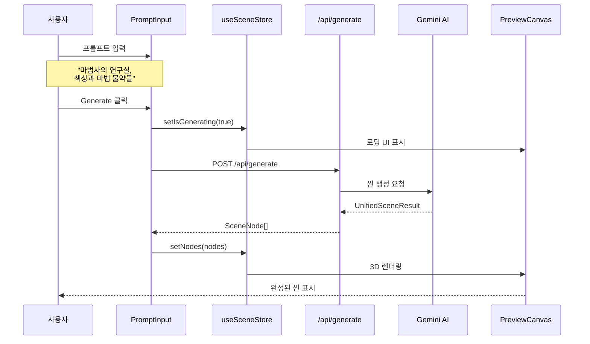

# 🧭 07. 사용자 흐름

> 주요 UX 시나리오, UI 구성, 라우팅, 인터랙션 상세

---

## 🎯 사용자 흐름 개요

WebPilot Engine은 **텍스트 → 3D 씬** 변환이라는 핵심 경험을 제공합니다.

```
┌─────────────────────────────────────────────────────────────┐
│                    User Journey Map                          │
├─────────────────────────────────────────────────────────────┤
│                                                               │
│  1. 랜딩 ─────▶ 2. 스튜디오 ─────▶ 3. 프롬프트 입력           │
│     /              /studio            텍스트 작성             │
│                                                               │
│                                           │                   │
│                                           ▼                   │
│                                                               │
│  6. 내보내기 ◀───── 5. 편집 ◀───── 4. 3D 생성                │
│     GLB 저장         노드 수정        AI 파이프라인           │
│                                                               │
└─────────────────────────────────────────────────────────────┘
```

---

## 📍 라우팅 구조

| 경로 | 페이지 | 설명 |
|------|--------|------|
| `/` | Landing | 랜딩 페이지, CTA |
| `/studio` | Creator Studio | 메인 작업 공간 |
| `/gallery` | Gallery | 생성된 씬 갤러리 |
| `/api/generate` | API | 씬 생성 엔드포인트 |
| `/api/resources/match` | API | 에셋 매칭 |

---

## 🖼️ UI 구성

### 스튜디오 레이아웃

```
┌─────────────────────────────────────────────────────────────┐
│  🌐 WebPilot Engine        [Gallery] [Help] [Settings]       │
├────────────────┬────────────────────────────┬───────────────┤
│                │                            │               │
│   Asset Panel  │     PreviewCanvas          │  Properties   │
│                │     (3D 뷰포트)             │   Panel       │
│   ┌─────────┐  │                            │               │
│   │ Search  │  │    ┌───────────────────┐   │  ┌─────────┐  │
│   ├─────────┤  │    │                   │   │  │ Node    │  │
│   │furniture│  │    │    3D Scene       │   │  │ Details │  │
│   │ nature  │  │    │                   │   │  │         │  │
│   │ props   │  │    │    ● ● ●          │   │  │ Position│  │
│   │ lighting│  │    │                   │   │  │ Rotation│  │
│   │  ...    │  │    │                   │   │  │ Scale   │  │
│   └─────────┘  │    └───────────────────┘   │  └─────────┘  │
│                │                            │               │
│   [+ Add New]  │    [Orbit] [Pan] [Zoom]    │  [Apply]      │
│                │                            │               │
├────────────────┴────────────────────────────┴───────────────┤
│                                                              │
│  ┌────────────────────────────────────────────────────────┐ │
│  │ 프롬프트 입력...                            [Generate ▶] │ │
│  └────────────────────────────────────────────────────────┘ │
│                                                              │
└─────────────────────────────────────────────────────────────┘
```

### 컴포넌트 구조

```typescript
// src/app/studio/page.tsx

export default function StudioPage() {
    return (
        <div className="flex h-screen">
            {/* 좌측: 에셋 패널 */}
            <aside className="w-64 border-r">
                <AssetPanel />
            </aside>

            {/* 중앙: 3D 뷰포트 + 프롬프트 입력 */}
            <main className="flex-1 flex flex-col">
                <div className="flex-1 relative">
                    <PreviewCanvas 
                        nodes={nodes}
                        isGenerating={isGenerating}
                        isEmpty={isEmpty}
                        prompt={prompt}
                    />
                </div>
                
                <div className="h-20 border-t p-4">
                    <PromptInput 
                        value={prompt}
                        onChange={setPrompt}
                        onGenerate={handleGenerate}
                        isLoading={isGenerating}
                    />
                </div>
            </main>

            {/* 우측: 속성 패널 */}
            <aside className="w-72 border-l">
                <PropertyPanel selectedNode={selectedNode} />
            </aside>
        </div>
    );
}
```

---

## 📝 시나리오 1: 기본 씬 생성

### 단계별 흐름



### 상태 변화

```typescript
// 생성 과정의 상태 변화

// 1. 초기 상태
{
    nodes: [],
    isGenerating: false,
    isEmpty: true,
    prompt: ""
}

// 2. 생성 시작
{
    nodes: [],
    isGenerating: true,  // 로딩
    isEmpty: true,
    prompt: "마법사의 연구실, 책상과 마법 물약들"
}

// 3. 생성 완료
{
    nodes: [
        { id: "desk_01", name: "책상", ... },
        { id: "potion_01", name: "마법 물약", ... },
        // ...
    ],
    isGenerating: false,
    isEmpty: false,
    prompt: "마법사의 연구실, 책상과 마법 물약들"
}
```

---

## 🖱️ 시나리오 2: 노드 선택 및 편집

### 인터랙션 흐름

```
1. 3D 뷰포트에서 오브젝트 클릭
   │
   ▼
2. 노드 선택 (아웃라인 표시)
   │
   ▼
3. PropertyPanel에 상세 정보 표시
   │
   ├──▶ Position (X, Y, Z) 슬라이더
   ├──▶ Rotation (X, Y, Z) 슬라이더
   ├──▶ Scale (X, Y, Z) 슬라이더
   └──▶ Delete 버튼
   │
   ▼
4. 값 변경 시 실시간 반영
```

### 구현 코드

```typescript
// src/components/studio/PropertyPanel.tsx

interface PropertyPanelProps {
    selectedNode: SceneNode | null;
}

export function PropertyPanel({ selectedNode }: PropertyPanelProps) {
    const { updateNode, removeNode, selectNode } = useSceneStore();

    if (!selectedNode) {
        return (
            <div className="p-4 text-gray-500">
                <p>오브젝트를 선택하세요</p>
            </div>
        );
    }

    const handlePositionChange = (axis: 'x' | 'y' | 'z', value: number) => {
        const newPosition = [...(selectedNode.transform?.position || [0, 0, 0])] as [number, number, number];
        const axisIndex = { x: 0, y: 1, z: 2 };
        newPosition[axisIndex[axis]] = value;
        
        updateNode(selectedNode.id, {
            transform: {
                ...selectedNode.transform,
                position: newPosition
            }
        });
    };

    const handleDelete = () => {
        removeNode(selectedNode.id);
        selectNode(null);
    };

    return (
        <div className="p-4 space-y-4">
            <h3 className="font-bold text-lg">{selectedNode.name}</h3>
            
            {/* Position */}
            <div>
                <label className="text-sm text-gray-500">Position</label>
                <div className="grid grid-cols-3 gap-2">
                    <input
                        type="number"
                        value={selectedNode.transform?.position?.[0] || 0}
                        onChange={(e) => handlePositionChange('x', parseFloat(e.target.value))}
                        step={0.1}
                    />
                    {/* Y, Z도 동일 */}
                </div>
            </div>
            
            {/* Rotation */}
            <div>
                <label className="text-sm text-gray-500">Rotation</label>
                {/* 유사하게 구현 */}
            </div>
            
            {/* Scale */}
            <div>
                <label className="text-sm text-gray-500">Scale</label>
                {/* 유사하게 구현 */}
            </div>
            
            {/* Delete */}
            <button
                onClick={handleDelete}
                className="w-full py-2 bg-red-500 text-white rounded"
            >
                삭제
            </button>
        </div>
    );
}
```

---

## 🎮 시나리오 3: 카메라 조작

### 컨트롤 매핑

| 입력 | 동작 |
|------|------|
| 좌클릭 드래그 | Orbit (궤도 회전) |
| 우클릭 드래그 | Pan (이동) |
| 스크롤 | Zoom (확대/축소) |
| 더블 클릭 | 오브젝트 선택 |
| ESC | 선택 해제 |

### OrbitControls 설정

```typescript
// src/components/studio/PreviewCanvas.tsx

import { OrbitControls } from '@react-three/drei';

function CameraController() {
    return (
        <OrbitControls
            enablePan={true}
            enableZoom={true}
            enableRotate={true}
            minDistance={1}
            maxDistance={100}
            minPolarAngle={0}
            maxPolarAngle={Math.PI * 0.9}
            dampingFactor={0.05}
            rotateSpeed={0.5}
            panSpeed={0.5}
            zoomSpeed={0.5}
        />
    );
}
```

---

## 📤 시나리오 4: 내보내기

### 지원 형식

| 형식 | 용도 |
|------|------|
| GLB | 3D 모델 (Three.js, Unity, Blender) |
| JSON | 씬 데이터 (재편집용) |
| PNG | 스크린샷 |

### 내보내기 흐름

```typescript
// src/components/studio/ExportPanel.tsx

async function exportAsGLB() {
    const scene = sceneRef.current;
    if (!scene) return;

    // GLTFExporter 사용
    const exporter = new GLTFExporter();
    
    const gltf = await new Promise((resolve) => {
        exporter.parse(
            scene,
            (result) => resolve(result),
            { binary: true }
        );
    });

    // 다운로드
    const blob = new Blob([gltf as ArrayBuffer], { type: 'model/gltf-binary' });
    const url = URL.createObjectURL(blob);
    const link = document.createElement('a');
    link.href = url;
    link.download = `${sceneName}.glb`;
    link.click();
}

async function exportAsJSON() {
    const data = {
        metadata: {
            generator: 'WebPilot Engine',
            version: '4.0',
            timestamp: new Date().toISOString()
        },
        prompt,
        nodes: nodes.map(serializeNode)
    };

    const blob = new Blob([JSON.stringify(data, null, 2)], { type: 'application/json' });
    // 다운로드 로직
}

async function captureScreenshot() {
    const canvas = document.querySelector('canvas');
    if (!canvas) return;

    const dataUrl = canvas.toDataURL('image/png');
    const link = document.createElement('a');
    link.href = dataUrl;
    link.download = `${sceneName}.png`;
    link.click();
}
```

---

## 📊 성능 지표 목표

| 지표 | 목표값 | 현재 |
|------|--------|------|
| 초기 로딩 (FCP) | < 1.5초 | ~1.2초 |
| 씬 생성 완료 | < 5초 | ~3-4초 |
| 프레임 레이트 | > 30 FPS | ~45 FPS |
| 에셋 로딩 | < 2초 | ~1.5초 |

### 성능 최적화 전략

```typescript
// 1. 에셋 프리로드
useEffect(() => {
    preloadCommonAssets();
}, []);

// 2. LOD (Level of Detail)
<Lod distances={[0, 10, 50]}>
    <HighDetailModel />  {/* 가까이 */}
    <MediumDetailModel /> {/* 중간 */}
    <LowDetailModel />   {/* 멀리 */}
</Lod>

// 3. 인스턴싱 (동일 모델 다수)
<Instances limit={100}>
    {candlePositions.map((pos, i) => (
        <Instance key={i} position={pos} />
    ))}
</Instances>

// 4. Frustum Culling (자동)
<mesh frustumCulled={true}>
    ...
</mesh>
```

---

## 🔄 상태 관리 흐름

```
┌─────────────────────────────────────────────────────────────┐
│                      Zustand Store                           │
│                    (useSceneStore.ts)                        │
├─────────────────────────────────────────────────────────────┤
│                                                               │
│   ┌───────────────┐     ┌───────────────┐                    │
│   │    nodes      │     │ selectedNodeId│                    │
│   │ SceneNode[]   │     │ string | null │                    │
│   └───────────────┘     └───────────────┘                    │
│                                                               │
│   ┌───────────────┐     ┌───────────────┐                    │
│   │ isGenerating  │     │   isEmpty     │                    │
│   │   boolean     │     │   boolean     │                    │
│   └───────────────┘     └───────────────┘                    │
│                                                               │
│   Actions:                                                    │
│   - setNodes(nodes)                                          │
│   - addNode(node)                                            │
│   - updateNode(id, updates)                                  │
│   - removeNode(id)                                           │
│   - selectNode(id | null)                                    │
│   - setIsGenerating(bool)                                    │
│                                                               │
└─────────────────────────────────────────────────────────────┘
         │
         │ 구독
         ▼
┌─────────────────────────────────────────────────────────────┐
│   PreviewCanvas │ PropertyPanel │ PromptInput │ ...         │
└─────────────────────────────────────────────────────────────┘
```

---

## 🎨 UI 테마

```css
/* 다크 테마 (기본) */
:root {
    --bg-primary: #1a1a2e;
    --bg-secondary: #16213e;
    --text-primary: #eee;
    --text-secondary: #888;
    --accent: #6366f1;
    --accent-hover: #818cf8;
    --border: #333;
}

/* 그리드 배경 */
.preview-canvas {
    background: radial-gradient(
        circle at center,
        var(--bg-secondary) 0%,
        var(--bg-primary) 100%
    );
}
```
