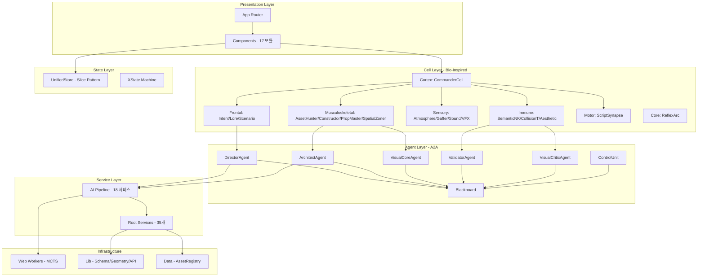

# 🗂️ 08. 코드 구조

> 모듈 의존성, 디렉터리 구조, 핵심 파일 상세  
> **최종 업데이트**: 2026-02-12

---

## 📁 디렉터리 구조 상세

```
WebPilot-Engine/
│
├── 📂 src/                                  # 소스 코드 루트
│   │
│   ├── 📂 app/                              # Next.js 14 App Router
│   │   ├── layout.tsx                       # 루트 레이아웃
│   │   ├── page.tsx                         # 랜딩 페이지 (/)
│   │   ├── globals.css                      # 전역 스타일
│   │   ├── 📂 api/                          # API Routes (서버리스)
│   │   ├── 📂 game/                         # 게임 라우트
│   │   ├── 📂 demo/                         # 데모 페이지
│   │   ├── 📂 landing/                      # 랜딩 변형
│   │   ├── 📂 reports/                      # R&D 리포트 뷰
│   │   ├── 📂 showcase/                     # 쇼케이스
│   │   ├── 📂 generative-ui/               # AI 생성 UI 라우트
│   │   ├── 📂 auth/                         # 인증
│   │   ├── 📂 debug/                        # 디버그 도구
│   │   └── 📂 test/                         # 테스트 페이지
│   │
│   ├── 📂 cells/                            # 🧠 Bio-Inspired 셀 아키텍처
│   │   ├── BaseCell.ts                      # 셀 공통 인터페이스
│   │   ├── types.ts                         # 셀 타입 정의
│   │   ├── index.ts                         # 셀 시스템 export
│   │   │
│   │   ├── 📂 core/                         # 반사 신경
│   │   │   └── ReflexArc.ts                 # 충돌 감지 + 즉각 반응 (10KB)
│   │   │
│   │   ├── 📂 cortex/                       # 중추 신경 (지휘)
│   │   │   └── CommanderCell.ts             # ⭐ 전체 파이프라인 조율 (23KB)
│   │   │
│   │   ├── 📂 frontal/                      # 전두엽 (인지/계획)
│   │   │   ├── IntentAnalystCell.ts         # 사용자 의도 분석
│   │   │   ├── LoreWeaverCell.ts            # 세계관/스토리 직조
│   │   │   └── ScenarioArchitectCell.ts     # 시나리오 구조 설계 (13KB)
│   │   │
│   │   ├── 📂 immune/                       # 면역 시스템 (품질 검증)
│   │   │   ├── SemanticNKCell.ts            # 시맨틱 무결성 검증
│   │   │   ├── CollisionTCell.ts            # 물리 충돌 검증
│   │   │   └── AestheticMacrophage.ts       # 미학 품질 검증
│   │   │
│   │   ├── 📂 motor/                        # 운동 신경 (실행)
│   │   │   └── ScriptSynapseCell.ts         # 스크립트 실행 + 시냅스 전달
│   │   │
│   │   ├── 📂 sensory/                      # 감각 신경 (환경)
│   │   │   ├── AtmosphereCell.ts            # 분위기/환경 설정
│   │   │   ├── GafferCell.ts                # 조명 설정
│   │   │   ├── SoundEngineerCell.ts         # 사운드 배치
│   │   │   └── VFXCell.ts                   # 시각 이펙트
│   │   │
│   │   └── 📂 musculoskeletal/              # 근골격 (물리 구현)
│   │       ├── AssetHunterCell.ts           # ⭐ 에셋 검색/매칭 (24KB)
│   │       ├── ConstructorSquad.ts          # ⭐ 씬 구축/렌더링 (20KB)
│   │       ├── PropMasterCell.ts            # 소품 배치/관리 (11KB)
│   │       └── SpatialZonerCell.ts          # 공간 영역 분할 (15KB)
│   │
│   ├── 📂 services/                         # 비즈니스 로직
│   │   │
│   │   │   # ── 루트 서비스 (35개) ──
│   │   ├── VectorSearchService.ts           # ⭐ 시맨틱 벡터 검색 (36KB)
│   │   ├── SemanticCacheService.ts          # 임베딩 캐시 (18KB)
│   │   ├── AssetOrchestrator.ts             # 에셋 오케스트레이션 (14KB)
│   │   ├── MissingResourceTracker.ts        # 미등록 에셋 추적 (15KB)
│   │   ├── R2StorageService.ts              # Cloudflare R2 CDN (13KB)
│   │   ├── AssetMetadataService.ts          # 에셋 메타데이터 (13KB)
│   │   ├── AssetRouter.ts                   # 에셋 라우팅 (9KB)
│   │   ├── LowPolyMaterialAdapter.ts        # Matcap/NPR 재질 (10KB)
│   │   ├── CameraSequencer.ts               # 카메라 시퀀스
│   │   ├── TTSService.ts                    # Text-to-Speech
│   │   ├── GeminiService.ts                 # Gemini API 래퍼
│   │   ├── TripoService.ts                  # Tripo 3D 생성
│   │   ├── VQALoop.ts                       # VLM 품질 피드백 루프
│   │   ├── VideoRecorder.ts                 # 씬 녹화
│   │   ├── StateMachineFactory.ts           # XState 머신 팩토리
│   │   └── ... (20+ 추가 서비스)
│   │   │
│   │   │   # ── 서브 디렉토리 (18개) ──
│   │   ├── 📂 a2a/                          # 🤖 A2A 에이전트 시스템
│   │   │   ├── DirectorAgent.ts             # 시나리오 감독 (11KB)
│   │   │   ├── ArchitectAgent.ts            # 공간 설계 (10KB)
│   │   │   ├── VisualCoreAgent.ts           # 렌더링 (11KB)
│   │   │   ├── ValidatorAgent.ts            # 규칙 검증 (12KB)
│   │   │   ├── VisualCriticAgent.ts         # VLM 비평 (10KB)
│   │   │   ├── Blackboard.ts               # 공유 메모리 (9KB)
│   │   │   ├── ControlUnit.ts              # 에이전트 조율 (9KB)
│   │   │   ├── AgentMessageBus.ts           # 메시지 버스 (5KB)
│   │   │   ├── BaseAgent.ts                 # 에이전트 기본 클래스
│   │   │   └── types.ts                     # 에이전트 타입
│   │   │
│   │   ├── 📂 ai-pipeline/                  # 🔧 7-Step AI 파이프라인
│   │   │   ├── AIPipelineOrchestrator.ts    # ⭐ 전체 조율 (33KB)
│   │   │   ├── MCTSPlacementService.ts      # ⭐ MCTS 배치 (64KB)
│   │   │   ├── AssetRetrievalService.ts     # 에셋 검색 (19KB)
│   │   │   ├── SemanticScaleResolver.ts     # 스케일 추론 (18KB)
│   │   │   ├── UnifiedSceneGenerationService.ts  # Director 씬 생성 (16KB)
│   │   │   ├── ResourceDecisionService.ts   # 리소스 결정 (12KB)
│   │   │   ├── PromptExpansionService.ts    # 프롬프트 확장 (12KB)
│   │   │   ├── AssetIntelligenceService.ts  # 에셋 지능 (11KB)
│   │   │   ├── SpatialRelationshipInferenceEngine.ts  # 공간 관계 추론 (11KB)
│   │   │   ├── ScaleReasoningService.ts     # 스케일 추론 (11KB)
│   │   │   ├── NSSEIntegrationService.ts    # NSSE 통합 (11KB)
│   │   │   ├── SpatialZoningService.ts      # 공간 분할 (10KB)
│   │   │   ├── PoissonDiskSamplingService.ts # 자연 분포 생성 (10KB)
│   │   │   ├── RenderValidationService.ts   # 렌더 검증 (8KB)
│   │   │   ├── AssetGenerationStreamService.ts  # 에셋 스트림 생성 (8KB)
│   │   │   ├── AssetBoundingBoxService.ts   # 바운딩 박스 (7KB)
│   │   │   ├── SkyboxDecisionService.ts     # 스카이박스 결정 (6KB)
│   │   │   ├── RelativeScalePolicy.ts       # 상대 스케일 정책 (6KB)
│   │   │   └── index.ts                     # 모듈 export
│   │   │
│   │   ├── 📂 quality/                      # ✅ 품질 검증 (QualityGate)
│   │   ├── 📂 search/                       # 🔍 시맨틱 검색
│   │   ├── 📂 spatial/                      # 📐 공간 계산
│   │   ├── 📂 validators/                   # ✔️ 6-Tier 검증기
│   │   ├── 📂 graph/                        # 🕸️ 지식 그래프
│   │   ├── 📂 narrative/                    # 📖 내러티브 엔진
│   │   ├── 📂 persona/                      # 👤 NPC 페르소나
│   │   ├── 📂 economy/                      # 💰 경제 시뮬레이션
│   │   ├── 📂 multiplayer/                  # 🌐 멀티플레이어
│   │   ├── 📂 xr/                           # 🥽 WebXR
│   │   ├── 📂 web3/                         # ⛓️ Story Protocol / ERC-6551
│   │   ├── 📂 judge/                        # ⚖️ LLM-as-Judge
│   │   ├── 📂 cache/                        # 💾 캐시 관리
│   │   ├── 📂 generation/                   # 🏗️ 에셋 생성
│   │   └── 📂 world/                        # 🌍 월드 관리
│   │
│   ├── 📂 components/                       # React + R3F 컴포넌트
│   │   ├── 📂 3d/                           # 3D 오브젝트
│   │   ├── 📂 canvas/                       # R3F Canvas
│   │   ├── 📂 scene/                        # 씬 관리
│   │   ├── 📂 effects/                      # 포스트 프로세싱
│   │   ├── 📂 game/                         # 게임 UI
│   │   ├── 📂 generative-ui/               # AI 생성 UI
│   │   ├── 📂 interaction/                  # 인터랙션
│   │   ├── 📂 studio/                       # 에디터/스튜디오
│   │   ├── 📂 landing/                      # 랜딩 페이지
│   │   ├── 📂 onboarding/                  # 온보딩
│   │   ├── 📂 audio/                        # 오디오 UI
│   │   ├── 📂 debug/                        # 디버그 패널
│   │   ├── 📂 tiles/                        # 타일 시스템
│   │   ├── 📂 splats/                       # 3D Gaussian Splat
│   │   ├── 📂 sorting/                      # 정렬 UI
│   │   ├── 📂 providers/                    # Context Providers
│   │   └── 📂 ui/                           # 공용 UI 컴포넌트
│   │
│   ├── 📂 store/                            # 💾 상태 관리 (Zustand SSOT)
│   │   ├── unifiedStore.ts                  # ⭐ 통합 스토어 (슬라이스 패턴)
│   │   ├── game.ts                          # 게임 상태
│   │   ├── gameStore.ts                     # 게임 스토어 (13KB)
│   │   ├── useObjectStore.ts                # 오브젝트 스토어 (5KB)
│   │   ├── useAudioStore.ts                 # 오디오 스토어
│   │   ├── useSceneStore.ts                 # 씬 스토어
│   │   ├── useGameStore.ts                  # 게임 훅
│   │   └── 📂 slices/                       # 상태 슬라이스
│   │
│   ├── 📂 machines/                         # 🎰 XState 상태 머신
│   │   └── objectMachine.ts                 # 오브젝트 인터랙션 머신
│   │
│   ├── 📂 workers/                          # ⚡ Web Workers
│   │   └── mcts.worker.ts                   # MCTS 병렬 연산 (9KB)
│   │
│   ├── 📂 brain/                            # 🧠 AI Brain 모듈
│   ├── 📂 ai/                               # 🤖 AI 유틸리티
│   ├── 📂 agent/                            # 에이전트 설정
│   ├── 📂 mcp/                              # MCP 서버 연동
│   ├── 📂 config/                           # 설정 파일
│   ├── 📂 context/                          # React Context
│   ├── 📂 hooks/                            # 커스텀 훅
│   ├── 📂 lib/                              # 유틸리티/라이브러리
│   │   ├── 📂 schema/                       # Zod 스키마 정의
│   │   ├── 📂 geometry/                     # 기하학적 시스템
│   │   └── 📂 api/                          # API 클라이언트
│   │
│   ├── 📂 data/                             # 정적 데이터
│   ├── 📂 utils/                            # 공용 유틸리티
│   ├── 📂 types/                            # TypeScript 타입
│   ├── 📂 content/                          # 콘텐츠 (daily 리포트)
│   └── middleware.ts                        # Next.js 미들웨어
│
├── 📂 public/                               # 정적 파일
│   ├── 📂 models/                           # 2,632 GLB 에셋 (Git LFS)
│   │   ├── 📂 Kenney/                       # CC0 에셋팩
│   │   ├── 📂 PolyPizza/                    # Poly Pizza 에셋
│   │   ├── 📂 generated/                    # SDXL+TripoSR 자체 생성 (952개)
│   │   └── 📂 ... (29개 카테고리)
│   ├── 📂 sounds/                           # BGM + SFX + Ambient (228개)
│   ├── 📂 skybox/                           # 스카이박스 + HDRI (90개)
│   └── 📂 textures/                         # PBR + 파티클 (527개)
│
├── 📂 docs/                                 # 프로젝트 문서
├── 📂 scripts/                              # 유틸리티 스크립트
├── 📂 content/                              # NSSE 아키텍처 문서
└── 📂 .agent/                               # 에이전트 설정
    ├── 📂 skills/                           # AI 스킬
    └── 📂 workflows/                        # 자동화 워크플로우
```

---

## 🔗 모듈 의존성 그래프

### 전체 아키텍처 레이어



### 셀-에이전트 매핑

```
CommanderCell (cortex)
    ├── IntentAnalystCell (frontal) ──────→ 사용자 의도 분석
    ├── LoreWeaverCell (frontal) ─────────→ 세계관 생성
    ├── ScenarioArchitectCell (frontal) ──→ 시나리오 설계
    │
    ├── AssetHunterCell (musculoskeletal) ─→ 에셋 검색/매칭
    ├── ConstructorSquad (musculoskeletal) ─→ 씬 구축
    ├── PropMasterCell (musculoskeletal) ──→ 소품 배치
    ├── SpatialZonerCell (musculoskeletal) ─→ 공간 분할
    │
    ├── AtmosphereCell (sensory) ─────────→ 분위기 설정
    ├── GafferCell (sensory) ─────────────→ 조명
    ├── SoundEngineerCell (sensory) ──────→ 사운드
    ├── VFXCell (sensory) ────────────────→ 시각 이펙트
    │
    ├── ScriptSynapseCell (motor) ────────→ 스크립트 실행
    ├── ReflexArc (core) ─────────────────→ 충돌 즉각 반응
    │
    └── SemanticNKCell (immune) ──────────→ 시맨틱 검증
        CollisionTCell (immune) ──────────→ 물리 검증
        AestheticMacrophage (immune) ─────→ 미학 검증
```

---

## 📋 핵심 파일 상세

### 1. CommanderCell.ts (23KB) — 중추 신경

```typescript
// 역할: 전체 파이프라인 조율, 셀 간 메시지 라우팅
// 위치: src/cells/cortex/CommanderCell.ts
// 주요 책임:
//   - 사용자 입력 → 적절한 셀에 분배
//   - 셀 실행 순서 관리
//   - Immune 시스템 검증 결과 대기
//   - 최종 결과 조합
```

### 2. AIPipelineOrchestrator.ts (33KB) — 파이프라인 조율

```typescript
// 역할: 7-Step AI 파이프라인 전체 실행 조율
// 위치: src/services/ai-pipeline/AIPipelineOrchestrator.ts
// 주요 책임:
//   - PromptExpansion → SpatialZoning → AssetIntelligence
//   → AssetRetrieval → ScaleReasoning → MCTSPlacement
//   → RenderValidation 순차 실행
```

### 3. MCTSPlacementService.ts (64KB) — MCTS 배치

```typescript
// 역할: Monte Carlo Tree Search 기반 최적 배치
// 위치: src/services/ai-pipeline/MCTSPlacementService.ts
// 알고리즘: Selection → Expansion → Simulation → Backpropagation
// 에너지 함수: 충돌 -1000, 중앙 +50, 바닥 +30
// 가속: BVH Tree + Poisson Disk Sampling
```

### 4. VectorSearchService.ts (36KB) — 시맨틱 검색

```typescript
// 역할: Gemini Embedding 기반 에셋 벡터 검색
// 위치: src/services/VectorSearchService.ts
// 주요 기능:
//   - gemini-embedding-001로 텍스트 → 벡터 변환
//   - 코사인 유사도 기반 에셋 매칭
//   - SemanticCache 연동 (중복 임베딩 방지)
```

### 5. AssetHunterCell.ts (24KB) — 에셋 사냥꾼

```typescript
// 역할: 씬에 필요한 에셋을 검색하고 최적 매칭
// 위치: src/cells/musculoskeletal/AssetHunterCell.ts
// 검색 전략:
//   1. VectorSearch (시맨틱)
//   2. AssetRegistry (키워드)
//   3. R2 Storage (CDN 폴백)
```

### 6. Blackboard.ts (9KB) — 에이전트 공유 메모리

```typescript
// 역할: A2A 에이전트 간 데이터 공유
// 위치: src/services/a2a/Blackboard.ts
// 패턴: 블랙보드 아키텍처
// Director가 쓰고 → Architect가 읽고 → Validator가 검증
```

---

## 🔧 빌드 설정

### package.json (핵심 의존성)

```json
{
    "dependencies": {
        "next": "^14.x",
        "react": "^18.x",
        "three": "^0.170.x",
        "@react-three/fiber": "^8.x",
        "@react-three/drei": "^9.x",
        "@google/generative-ai": "^0.21.x",
        "zustand": "^4.x",
        "xstate": "^5.x",
        "tailwindcss": "^3.x",
        "zod": "^3.x"
    }
}
```

---

## 📊 코드 통계

| 항목 | 수치 |
|------|------|
| src/ 하위 디렉토리 | 19개 |
| 셀 (cells/) | 15개 (7계층) |
| A2A 에이전트 (a2a/) | 5 + 3 인프라 = 8개 |
| AI 파이프라인 서비스 | 18개 |
| 루트 서비스 파일 | 35개 |
| 서비스 서브 디렉토리 | 18개 |
| 컴포넌트 모듈 | 17개 |
| 총 에셋 | 3,477개 |
| GLB 모델 | 2,632개 |
