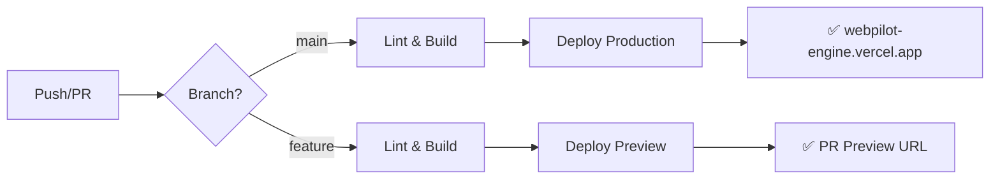

# 🚀 09. 배포 및 운영

> Vercel 배포, CI/CD, 환경 변수, 모니터링 상세 가이드

---

## 🌐 배포 환경 개요

| 환경 | URL | 용도 | 브랜치 |
|------|-----|------|--------|
| **Production** | webpilot-engine.vercel.app | 라이브 서비스 | main |
| **Preview** | PR별 자동 생성 | 코드 리뷰 | feature/* |
| **Local** | localhost:3000 | 개발 | - |

---

## 🔧 환경 변수 설정

### 필수 환경 변수

```env
# .env.local (로컬 개발용)

# ─────────────────────────────────────────
# AI API 키 (필수)
# ─────────────────────────────────────────
GEMINI_API_KEY=AIzaSy...                     # Google Gemini API

# ─────────────────────────────────────────
# 외부 서비스 (선택)
# ─────────────────────────────────────────
TRIPO_API_KEY=tsk_...                        # Tripo 3D 생성
HYPER3D_API_KEY=hyper_...                    # Hyper3D 대안

# ─────────────────────────────────────────
# 데이터베이스
# ─────────────────────────────────────────
DATABASE_URL="file:./prisma/dev.db"          # SQLite (로컬)
# DATABASE_URL="postgres://..."              # PostgreSQL (프로덕션)

# ─────────────────────────────────────────
# 앱 설정
# ─────────────────────────────────────────
NEXT_PUBLIC_API_URL=http://localhost:3000    # API 베이스 URL
NODE_ENV=development                          # 환경
```

### Vercel 환경 변수 설정

```bash
# Vercel CLI로 환경 변수 설정
vercel env add GEMINI_API_KEY production
vercel env add GEMINI_API_KEY preview
vercel env add GEMINI_API_KEY development

# 또는 Vercel Dashboard에서 설정:
# Settings > Environment Variables
```

| 변수명 | 환경 | 암호화 |
|--------|------|--------|
| GEMINI_API_KEY | Production, Preview, Development | ✅ |
| TRIPO_API_KEY | Production, Preview | ✅ |
| DATABASE_URL | Production | ✅ |

---

## 📋 배포 체크리스트

### 배포 전 점검

```bash
# 1. 로컬 빌드 테스트
npm run build

# 2. 린트 검사
npm run lint

# 3. 타입 체크
npx tsc --noEmit

# 4. 환경 변수 확인
echo $GEMINI_API_KEY  # 설정 여부 확인
```

### 예상 출력

```
✓ Compiled successfully
✓ Linting and checking validity of types
✓ Collecting page data
✓ Generating static pages (5/5)
✓ Collecting build traces
✓ Finalizing page optimization

Route (app)                              Size     First Load JS
┌ ○ /                                    5.24 kB       105 kB
├ ○ /gallery                             2.31 kB       102 kB
├ ○ /studio                              156 kB        261 kB
├ λ /api/generate                        0 B           0 B
└ λ /api/resources/match                 0 B           0 B

○  (Static)   prerendered as static content
λ  (Dynamic)  server-rendered on demand

✓ Build completed in 45s
```

---

## 🚀 Vercel CLI 배포

### 초기 설정

```bash
# Vercel CLI 설치
npm i -g vercel

# 로그인
vercel login

# 프로젝트 링크
vercel link
```

### 배포 명령어

```bash
# ─────────────────────────────────────────
# 프로덕션 배포 (main 브랜치)
# ─────────────────────────────────────────
vercel --prod

# ─────────────────────────────────────────
# 프리뷰 배포 (PR/기능 브랜치)
# ─────────────────────────────────────────
vercel

# ─────────────────────────────────────────
# 강제 재배포 (캐시 무시)
# ─────────────────────────────────────────
vercel --force
```

### 배포 로그 예시

```
Vercel CLI 33.x.x
🔍  Inspect: https://vercel.com/team/project/xxxxx
✅  Production: https://webpilot-engine.vercel.app [45s]
```

---

## 📁 Vercel 설정 파일

### vercel.json

```json
{
    "framework": "nextjs",
    "buildCommand": "npm run build",
    "outputDirectory": ".next",
    "installCommand": "npm install",
    "devCommand": "npm run dev",
    "regions": ["icn1"],
    "functions": {
        "src/app/api/**/*.ts": {
            "memory": 1024,
            "maxDuration": 30
        }
    },
    "headers": [
        {
            "source": "/models/(.*)",
            "headers": [
                {
                    "key": "Cache-Control",
                    "value": "public, max-age=31536000, immutable"
                }
            ]
        }
    ]
}
```

### .vercelignore

```
# 배포에서 제외할 파일

# 개발 관련
node_modules
.git
*.log
.env.local
.env.development

# 백업/임시
_backup_legacy
temp_*
*.bak

# 테스트
__tests__
*.test.ts
*.spec.ts

# 문서
docs/
*.md
!README.md

# IDE
.vscode
.idea

# 에이전트 설정
.agent/data
```

---

## 🔄 CI/CD 파이프라인

### GitHub Actions 워크플로우

```yaml
# .github/workflows/deploy.yml

name: Deploy to Vercel

on:
  push:
    branches: [main]
  pull_request:
    branches: [main]

env:
  VERCEL_ORG_ID: ${{ secrets.VERCEL_ORG_ID }}
  VERCEL_PROJECT_ID: ${{ secrets.VERCEL_PROJECT_ID }}

jobs:
  lint-and-build:
    runs-on: ubuntu-latest
    steps:
      - uses: actions/checkout@v4
      
      - name: Setup Node.js
        uses: actions/setup-node@v4
        with:
          node-version: '20'
          cache: 'npm'

      - name: Install dependencies
        run: npm ci

      - name: Lint check
        run: npm run lint

      - name: Type check
        run: npx tsc --noEmit

      - name: Build
        run: npm run build

  deploy-preview:
    needs: lint-and-build
    runs-on: ubuntu-latest
    if: github.event_name == 'pull_request'
    steps:
      - uses: actions/checkout@v4

      - name: Install Vercel CLI
        run: npm i -g vercel

      - name: Deploy Preview
        run: vercel --token ${{ secrets.VERCEL_TOKEN }}

  deploy-production:
    needs: lint-and-build
    runs-on: ubuntu-latest
    if: github.ref == 'refs/heads/main' && github.event_name == 'push'
    steps:
      - uses: actions/checkout@v4

      - name: Install Vercel CLI
        run: npm i -g vercel

      - name: Deploy Production
        run: vercel --prod --token ${{ secrets.VERCEL_TOKEN }}
```

### 워크플로우 다이어그램



---

## 🗄️ 데이터베이스 운영

### 로컬 개발

```bash
# Prisma 설정
npx prisma init

# 마이그레이션 생성
npx prisma migrate dev --name init

# 마이그레이션 적용
npx prisma migrate dev

# Prisma Studio (DB GUI)
npx prisma studio

# DB 시드
npx prisma db seed
```

### 시드 스크립트

```typescript
// prisma/seed.ts

import { PrismaClient } from '@prisma/client';
import fs from 'fs';
import path from 'path';

const prisma = new PrismaClient();

async function main() {
    // 에셋 스캔 및 등록
    const modelsDir = path.join(process.cwd(), 'public/models');
    const glbFiles = scanGLBFiles(modelsDir);
    
    for (const file of glbFiles) {
        await prisma.asset3D.upsert({
            where: { filePath: file.relativePath },
            create: {
                name: file.name,
                filePath: file.relativePath,
                category: file.category,
                tags: JSON.stringify(file.tags),
                keywords: JSON.stringify(file.keywords),
                source: file.source
            },
            update: {}
        });
    }
    
    console.log(`✅ ${glbFiles.length}개 에셋 시드 완료`);
}

main()
    .catch(console.error)
    .finally(() => prisma.$disconnect());
```

### 프로덕션 마이그레이션

```bash
# 프로덕션 DB 마이그레이션 (주의!)
npx prisma migrate deploy

# 스키마 동기화 (데이터 손실 주의)
npx prisma db push
```

---

## 📊 모니터링

### Vercel Analytics

```typescript
// app/layout.tsx

import { Analytics } from '@vercel/analytics/react';
import { SpeedInsights } from "@vercel/speed-insights/next";

export default function RootLayout({ children }) {
    return (
        <html>
            <body>
                {children}
                <Analytics />
                <SpeedInsights />
            </body>
        </html>
    );
}
```

### 성능 지표 목표

| 메트릭 | 목표값 | 현재 | 상태 |
|--------|--------|------|------|
| FCP (First Contentful Paint) | < 1.5s | ~1.2s | ✅ |
| LCP (Largest Contentful Paint) | < 2.5s | ~2.0s | ✅ |
| CLS (Cumulative Layout Shift) | < 0.1 | ~0.05 | ✅ |
| FID (First Input Delay) | < 100ms | ~50ms | ✅ |
| 빌드 시간 | < 3min | ~45s | ✅ |

### 로깅

```typescript
// 서버 로그
console.log('[Pipeline] 씬 생성 시작:', prompt);
console.log('[MCTS] 배치 완료:', stats);
console.error('[API Error]:', error);

// 클라이언트 로그
console.log('[PreviewCanvas] 노드 렌더링:', nodes.length);
console.log('[ScaleResolver] 스케일 계산:', result);
```

---

## 🔒 보안 고려사항

### API 키 보호

```typescript
// ❌ 절대 하지 말 것
const API_KEY = "AIzaSy...";  // 하드코딩 금지!

// ✅ 환경 변수 사용
const API_KEY = process.env.GEMINI_API_KEY;

// ✅ 서버 사이드에서만 사용
export async function POST(request: NextRequest) {
    const apiKey = process.env.GEMINI_API_KEY;
    if (!apiKey) {
        return NextResponse.json(
            { error: 'API key not configured' },
            { status: 500 }
        );
    }
    // ...
}
```

### Rate Limiting

```typescript
// src/middleware.ts

import { Ratelimit } from '@upstash/ratelimit';
import { Redis } from '@upstash/redis';

const ratelimit = new Ratelimit({
    redis: Redis.fromEnv(),
    limiter: Ratelimit.slidingWindow(10, '10 s'), // 10초에 10회
});

export async function middleware(request: NextRequest) {
    const ip = request.ip ?? '127.0.0.1';
    const { success } = await ratelimit.limit(ip);
    
    if (!success) {
        return NextResponse.json(
            { error: 'Too many requests' },
            { status: 429 }
        );
    }
}
```

---

## 🐛 트러블슈팅

### 일반적인 배포 오류

| 오류 | 원인 | 해결책 |
|------|------|--------|
| Build failed | 타입 오류/린트 | `npm run lint && tsc --noEmit` |
| 500 Internal Error | 환경 변수 누락 | Vercel 환경 변수 확인 |
| 404 on API routes | 라우트 경로 오류 | `/api/` 경로 확인 |
| Prisma error | DB 연결 실패 | DATABASE_URL 확인 |

### 롤백

```bash
# 이전 배포로 롤백
vercel rollback [deployment-url-or-id]

# 특정 커밋으로 재배포
git checkout <commit-hash>
vercel --prod
```
