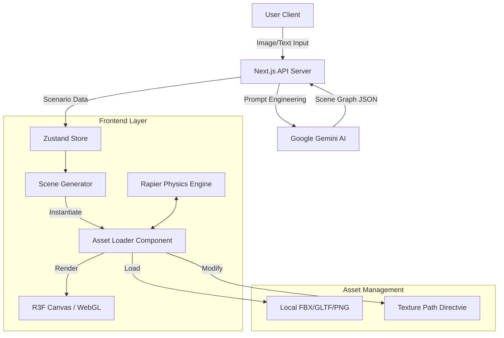

# WebPilot Engine: 기술 설계 및 아키텍처 보고서 (Technical Design Document)

## 1. 프로젝트 개요 (Overview)

**WebPilot Engine**은 사용자의 **상상(텍스트/이미지)**을 즉시 **상호작용 가능한 3D 가상 공간(Metaverse)**으로 구현하는 차세대 웹 기반 3D 엔진입니다.
Google **Gemini 2.0 Flash**의 강력한 멀티모달 분석 능력과 **React Three Fiber (R3F)**의 웹 3D 렌더링 기술을 결합하여, 별도의 설치 없이 브라우저에서 즉시 실행되는 몰입형 경험을 제공합니다.

### 1.1 핵심 목표

* **Instant 3D Creation**: 자연어/이미지 입력만으로 씬(Scene) 그래프 자동 생성 및 렌더링.
* **Seamless Interaction**: 1인칭 시점(FPS) 탐험, NPC 대화, 오브젝트 상호작용의 자연스러운 통합.
* **Scalable Architecture**: FBX, GLTF 등 다양한 포맷의 3D 자산을 동적으로 로드하고 최적화.

---

## 2. 시스템 아키텍처 (System Architecture)

본 프로젝트는 **Next.js 14 (App Router)** 기반의 클라이언트-서버 구조를 따르며, 3D 렌더링을 위해 **R3F** 생태계를 활용합니다.

### 2.1 기술 스택 (Tech Stack)

* **Framework**: Next.js 14 (TypeScript)
* **3D Engine**: React Three Fiber (Three.js), Drei (Utilities)
* **Physics**: React Three Rapier (WASM based)
* **AI Core**: Google Gemini 2.0 Flash (Multimodal)
* **State Management**: Zustand
* **Styling**: Tailwind CSS

---

## 3. 핵심 모듈 상세 (Core Modules)

### 3.1 Asset Loader System (`AssetLoader.tsx`)

가장 핵심적인 모듈로, 이질적인 3D 자원(FBX, GLTF)을 통합 관리하고 런타임에 보정합니다.

* **Dynamic Format Support**: `.fbx`와 `.glb/.gltf`를 자동 감지하여 적절한 로더(Loader)를 선택합니다.
* **Intelligent Texture Remapping**:
  * 웹에서 지원하지 않는 `.dds` 텍스처 요청을 가로채어 `.png`로 자동 변환.
  * FBX 내부의 절대/상대 경로가 깨져 있을 경우, `LoadingManager` 수준에서 URL을 재작성하여 올바른 텍스처 경로(`/textures/`)로 리디렉션. (최근 **Grand Hall Rendering Issue** 해결의 핵심)
* **Auto-Grounding System**: 모델의 Bounding Box를 계산하여, 원점이 중앙에 있거나 붕 떠 있는 모델을 자동으로 지면(y=0)에 안착시킵니다.
* **React Immutability Compliance**: Three.js 객체를 직접 변형(Mutation)하는 대신, React Memo를 통해 오프셋을 계산하고 렌더링 시점에 반영하여 Side-effect를 방지합니다.

### 3.2 Scene Generator (`SceneGenerator.tsx`)

Gemini가 생성한 JSON 시나리오 데이터를 해석하여 3D 월드를 구축합니다.

* **Node-based Architecture**: 시나리오를 노드(Node)와 관계(Relationship)로 정의하여 확장성 확보.
* **Lazy Loading & Suspense**: 대용량 에셋 로딩 시 `Hologram Placeholder`를 먼저 표시하여 UX 저하 방지.
* **Interactive Prop Hydration**: 단순 메쉬(Static Mesh)에 상호작용성(Interaction)과 물리학(Physics) 속성을 주입.

### 3.3 Sorting Ceremony Logic (`houseScenarios.ts`)

호그와트 기숙사 배정식을 구현한 특수 시나리오 모듈입니다.

* **Event-Driven Flow**: 입장 -> 소팅 햇 대면 -> 질문/답변 -> 기숙사 배정 -> 결과 연출.
* **Visual Fidelity**: 대연회장(Grand Hall)의 1:1 스케일 구현, 촛불 효과, 환경맵(Skybox) 적용.

---

## 4. 기술적 문제 해결 사례 (Troubleshooting Log)

### 4.1 Grand Hall 텍스처 실종 및 렌더링 실패 (Critical)

* **증상**: 대연회장 모델 로드 시 404 에러 발생 및 모델이 보이지 않음.
* **원인**:
    1. FBX 모델이 웹 미지원 `DDS` 포맷 텍스처를 참조.
    2. 텍스처 경로가 모델 내부 `source` 디렉토리로 하드코딩 되어 있으나 실제 파일은 `textures` 디렉토리에 위치.
    3. `AssetLoader`의 경로 수정 로직이 모델 파일 자체(.fbx)까지 텍스처 경로로 바꿔버리는 사이드 이펙트 발생.
* **해결**:
  * `Three.js LoadingManager`를 커스텀하여 URL 요청을 인터셉트.
  * 확장자가 이미지(.png, .jpg 등)인 경우에만 경로 리디렉션을 적용하도록 정규식 필터 강화.
  * `.dds` 요청을 `.png`로 실시간 치환.
  * 모델 스케일을 `0.01` -> `1.0`으로 현실화하여 가시성 확보.

### 4.2 React Hydration 및 Audio Pool 이슈

* **증상**: 브라우저 콘솔에 `HTML5 Audio pool exhausted` 경고 다발.
* **해결**: `AudioManager`를 싱글톤 패턴으로 관리하고, 사용자 인터랙션 이후에만 오디오 컨텍스트를 활성화하도록 수정. 불필요한 리렌더링 방지.

---

## 5. 향후 로드맵 (Roadmap)

1. **Phase 2: Advanced Interaction**
    * NPC 대화 시스템에 LLM 페르소나 연동 (소팅 햇이 유저 성향 분석).
    * 아이템 인벤토리 시스템 UI 구현.
2. **Phase 3: Multiplayer**
    * WebSockets (Liveblocks/PartyKit) 도입으로 다중 사용자 동시 접속 지원.
    * 친구와 함께 기숙사 배정받기 기능.
3. **Phase 4: Optimization**
    * LOD (Level of Detail) 시스템 도입으로 대규모 씬 프레임 방어.
    * Draco 압축 전면 적용으로 에셋 로딩 속도 50% 단축.

---

**작성일**: 2026. 01. 14.
**작성자**: WebPilot Engine Architecture Team
