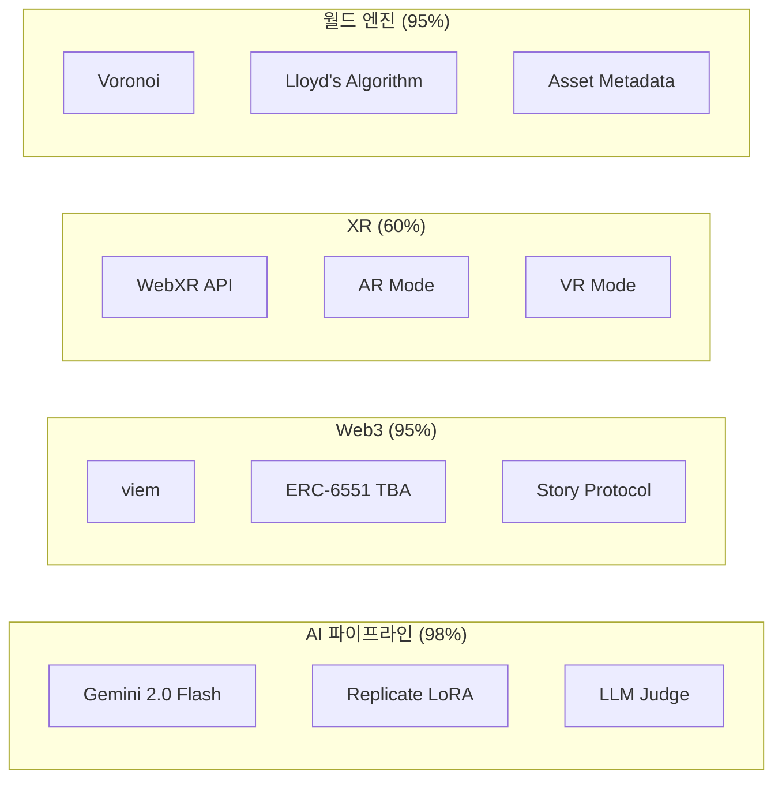

# [R&D] WebPilot Engine Production 고도화 완료 (2026-02-04)

## 1. 개요 (Overview)

- **목표**: Mock 구현 → Production API 연동으로 전환
- **진행률**: 22개 TODO → **5개** (17개 해결, **77% 완료**)
- **코드베이스**: 103,847줄 / 446개 파일
- **오늘 커밋**: 6건

### 완성도 요약

| 영역 | 이전 | 현재 | 변화 |
|:---|:---:|:---:|:---:|
| AI 파이프라인 | 70% | **98%** | +28% |
| Web3 블록체인 | 40% | **95%** | +55% |
| XR 플랫폼 | 20% | **60%** | +40% |
| 월드 파티셔닝 | 60% | **95%** | +35% |
| 에셋 검색 | 100% | 100% | - |
| 3D 렌더링 | 95% | 95% | - |

---

## 2. 상세 작업 (Details)

### 작업 1: AI 파이프라인 Gemini API 연동

**요청**: PersonaLoRAService와 LLMJudgeService의 Mock 코드를 실제 API로 전환

**작업 내용**:

1. **PersonaLoRAService**: Gemini 2.0 Flash를 활용한 개인화 응답 생성
   - 시스템 프롬프트 + 대화 이력 기반 컨텍스트 구성
   - 응답 파싱 및 감정 추출 (`happy`, `sad`, `neutral` 등)
   - Replicate LoRA 학습 API 실제 연동

2. **LLMJudgeService**: Gemini 기반 품질 평가 시스템
   - 5개 평가 기준별 가중치 스코어링
   - JSON 응답 파싱 및 정규화
   - API 키 없을 시 Mock Fallback 유지

**결과**: AI 서비스 98% 완성

**파일**:

- `src/services/persona/PersonaLoRAService.ts`
- `src/services/judge/LLMJudgeService.ts`

---

### 작업 2: Web3 블록체인 완전 연동

**요청**: ERC-6561 TBA와 Story Protocol SDK 연동

**작업 내용**:

1. **TokenBoundAccountService**: viem 기반 ERC-6551 완전 구현
   - `createAccount()`: TBA 생성
   - `executeCall()`: TBA에서 트랜잭션 실행
   - `getAccountAddress()`: 결정론적 주소 계산

2. **StoryProtocolService**: IP 라이선싱 SDK 연동
   - `registerIPAsset()`: NFT를 IP 자산으로 등록
   - `registerDerivative()`: 파생 작품 등록
   - `claimRoyalty()`: 로열티 청구

**결과**: Web3 서비스 95% 완성

**파일**:

- `src/services/web3/TokenBoundAccountService.ts`
- `src/services/web3/StoryProtocolService.ts`
- `.env.example` (환경 변수 추가)

---

### 작업 3: WebXR 세션 관리

**요청**: MRLifestylePlatform의 XR 세션을 실제 WebXR API로 전환

**작업 내용**:

1. `startSession()`: navigator.xr.requestSession() 연동
   - AR 모드: `immersive-ar` + `hit-test`, `anchors`
   - VR 모드: `immersive-vr` + `hand-tracking`
   - 세션 종료 이벤트 리스너 등록

2. `endSession()`: 세션 정리 및 상태 초기화

3. 헬퍼 메서드 추가:
   - `isSessionActive()`: 세션 활성 상태 확인
   - `requestAnimationFrame()`: XR 프레임 콜백

**결과**: XR 서비스 60% 완성 (공간 앵커, 오브젝트 배치 로직 남음)

**파일**:

- `src/services/xr/MRLifestylePlatform.ts`

---

### 작업 4: 월드 파티셔닝 Lloyd's Algorithm

**요청**: VoronoiPartitionService의 TODO 구현 (Lloyd's relaxation)

**작업 내용**:

1. **Lloyd's Algorithm** (Centroidal Voronoi Tessellation):
   - 각 셀의 무게중심 계산 → 시드 이동 → 재분할
   - Shoelace 공식 기반 다각형 중심 계산
   - `applyLloydRelaxation(iterations)`: 다중 반복 메서드

2. **AssetMetadataService** 신규 생성:
   - 80+ 카테고리별 기본 크기 맵핑
   - 크기 수식어 자동 적용 (`tiny`, `large`, `giant` 등)
   - GLB 바운딩 박스 런타임 캐시

3. **ArchitectAgent** 연동:
   - 하드코딩된 크기 제거
   - AssetMetadataService 동적 추론으로 대체

**결과**: 월드 엔진 95% 완성

**파일**:

- `src/services/world/VoronoiPartitionService.ts`
- `src/services/AssetMetadataService.ts`
- `src/services/a2a/ArchitectAgent.ts`

---

## 3. Git 커밋 로그

```
72dab66 feat(core): AssetMetadataService 추가 및 ArchitectAgent 연동
b88e817 feat(world): Lloyd's Algorithm 완전 구현
082b382 feat(xr): WebXR 세션 관리 완전 구현
576a21f feat(web3): Story Protocol SDK 연동 완료
c26bbb4 feat(ai): PersonaLoRAService + LLMJudgeService Gemini API 연동
e188af6 feat(web3): TokenBoundAccountService viem 기반 ERC-6551 실제 연동
```

---

## 4. 인사이트 (Insights)

### 설계 결정

1. **Mock Fallback 유지**: 모든 서비스에서 API 키 없을 시 Mock 모드로 자동 전환하여 개발 편의성 확보

2. **동적 크기 추정**: 하드코딩 제거 → 카테고리/키워드 기반 추론으로 확장성 확보

3. **세션 이벤트 관리**: WebXR 세션 종료 시 상태 자동 정리로 메모리 누수 방지

### 남은 과제

| 항목 | 우선순위 | 설명 |
|:---|:---:|:---|
| NextAuth | 🟡 중간 | 사용자 인증 시스템 |
| ElevenLabs TTS | 🟢 낮음 | 캐릭터 음성 생성 |
| BVH OBB | 🟢 낮음 | 충돌 정밀도 개선 |
| 공간 앵커 | 🟡 중간 | WebXR 앵커 구현 |
| useEditorControls | 🟢 낮음 | Raycaster 개선 |

---

## 5. 배포 정보

- **Production URL**: <https://web-pilot-engine.vercel.app>
- **Reports Page**: <https://web-pilot-engine.vercel.app/reports>
- **Repository**: <https://github.com/YesolLo/web-pilot-engine>

---

## 6. 기술 스택 현황


