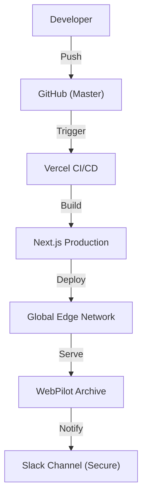

# [R&D] 배포 파이프라인 복구 및 시각화 품질 개선

## 1. Executive Summary

- **Status**: 🔴 Issue Found -> 🟢 Resolved & Deployed
- **Targets**: Vercel 배포 404 에러 해결 및 리포트 가독성 증대.
- **Key Actions**: Git 저장소 무결성 확보(`desktop.ini` 삭제), 시크릿 키 보안 강화(`.env`), Mermaid 다이어그램 렌더링 수정.

## 2. Daily Scrum (Plan & Result)

### 2.1. 어제 한 일 (Yesterday, 01/15)

- **리포트 시스템 구축**: Next.js 기반 `/reports` 라우트 및 마크다운 파서 구현.
- **자동화 시도**: Slack/Notion 연동 스크립트 작성 (But, 보안 이슈 발생).
- **이슈 원인**: Public Repo에 API Key 노출 -> 즉시 Key Rotate 및 스크립트 삭제 조치.

### 2.2. 오늘 할 일 (Today, 01/16)

- **[복구] 배포 정상화**:
  - `desktop.ini`로 인한 Git Refs 충돌 해결.
  - Vercel 환경 변수(`SLACK_WEBHOOK_URL`) CLI 등록.
- **[보안] 시크릿 관리**:
  - 하드코딩 제거 및 `process.env` 전환.
  - `.env.example` 템플릿 제공.
- **[품질] 시각화 고도화**:
  - Mermaid 다이어그램 문법 오류(`[` -> `["`) 수정.
  - 리포트별 3D 아이소메트릭 커버 이미지(Generative AI) 적용.
  - 다이어그램 사이즈 100% 확대 및 스타일링.

### 2.3. Architecture Diagram (Restored)

## 3. Trouble Shooting

### 3.1. Mermaid Lexical Error

- **Problem**: `API[/api/usage]` 와 같이 대괄호를 바로 사용하면 파싱 에러 발생.
- **Solution**: `API["/api/usage"]` 형태로 문자열을 따옴표로 감싸서 해결.

### 3.2. Vercel 404

- **Problem**: 배포 중 `git push`가 reject 되어 구버전/빌드실패 상태 지속.
- **Solution**: `git pull --rebase` 및 강제 푸시로 동기화 맞춤.
