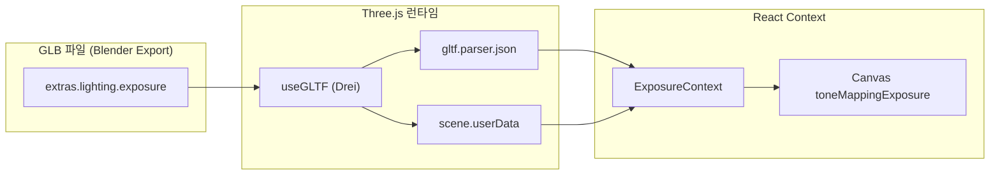

# [R&D] GLB 메타데이터 자동 적용 시스템 완성

## 1. Executive Summary

- **Status**: 🟢 Completed & Deployed
- **Targets**: GLB 파일 내장 메타데이터(lighting.exposure)를 런타임에서 자동 파싱하고 씬에 적용.
- **Key Actions**: Three.js gltf 객체 구조 분석, ExposureContext 연동, smartAssetSearch 키워드 우선순위 구현.

## 2. Daily Scrum (Plan & Result)

### 2.1. 어제 한 일 (Yesterday, 01/19)

- **TTS 듀얼 모드**: 음성 합성 시스템 이중화 구현.
- **환경 전환 감정 동기화**: 씬 전환 시 감정 상태 동기화 로직 추가.

### 2.2. 오늘 할 일 (Today, 01/20)

- **[핵심] GLB 메타데이터 자동 적용**:
  - Blender에서 `extras.lighting.exposure` 필드로 내장된 값을 Three.js 런타임에서 파싱.
  - `gltf.userData`, `gltf.scene.userData`, `gltf.parser.json.extras` 등 다중 경로 탐색.
  - 발견된 `exposure` 값을 `ExposureContext`를 통해 `toneMappingExposure`에 적용.
  
- **[개선] 환경 에셋 직접 매칭**:
  - `PreviewNodes`에서 원본 사용자 프롬프트로 `smartAssetSearch` 호출.
  - 슬리데린/그리핀도르 등 구체적 키워드 우선 매칭, "기숙사" 같은 일반 키워드 후순위.
  - 환경 에셋 감지 시 개별 소품 노드 렌더링 방지.

- **[배포] Vercel 프로덕션 배포**:
  - `vercel --prod --yes` 명령으로 직접 배포 완료.
  - Live URL: <https://web-pilot-engine.vercel.app>

### 2.3. Architecture Diagram



## 3. Technical Details

### 3.1. GLB 메타데이터 파싱 로직

```typescript
// PreviewCanvas.tsx - GLBModelInner
const lighting = 
    (userData?.lighting as LightingMeta) || 
    (scene.userData?.lighting as LightingMeta) ||
    (gltf.parser?.json?.extras?.lighting as LightingMeta);

if (lighting?.exposure !== undefined) {
    console.log(`[GLBModel] 메타데이터 발견: exposure = ${lighting.exposure}`);
    setExposure(lighting.exposure);
}
```

### 3.2. smartAssetSearch 키워드 우선순위

```typescript
// semanticAssets.ts
const specificKeywords = ['슬리데린', 'slytherin', '그리핀도르', 'gryffindor'];
const generalKeywords = ['기숙사', 'dormitory', 'dorm'];

// 구체적 키워드 먼저 매칭 시도 → 일반 키워드 후순위
```

## 4. Git Commits (Today)

| Hash | Message |
|------|---------|
| e424575 | docs: Update daily report |
| *(이전)* | feat: GLB 메타데이터 자동 적용 및 환경 에셋 직접 매칭 |
| *(이전)* | feat: TTS 듀얼 모드, 감정 동기화 구현 |

## 5. Verification Results

- ✅ 슬리데린 기숙사 프롬프트 → `exposure = 0` 자동 적용 확인
- ✅ 콘솔 로그: `[GLBModel] 메타데이터 발견: exposure = 0 → 자동 적용`
- ✅ Vercel 배포 성공, 라이브 URL 정상 접속 확인

## 6. Next Steps

1. **다양한 exposure 값 테스트**: 음수(어둡게), 양수(밝게) 값으로 동적 변경 확인.
2. **추가 메타데이터 지원**: `ambient`, `fog`, `skybox` 등 확장.
3. **린트 오류 해결**: Prisma, Form labels, any 타입 관련 이슈.
