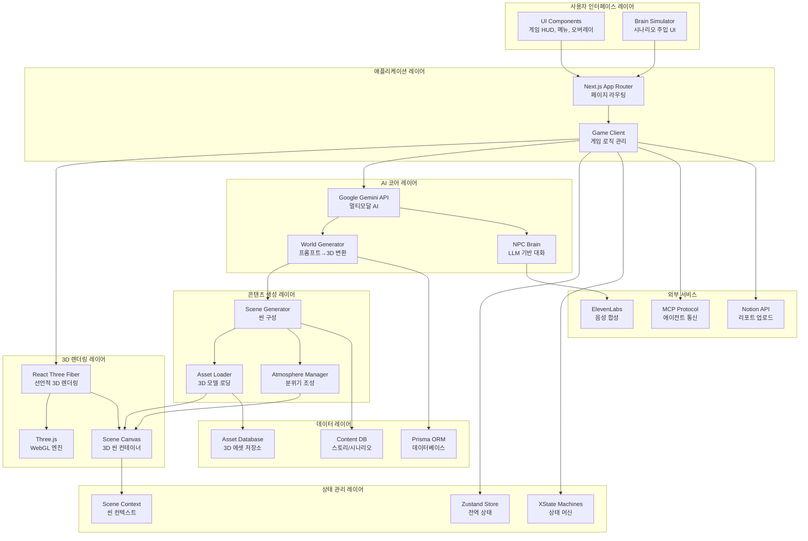
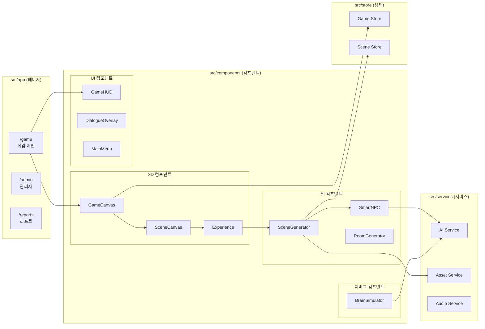

# WebPilot-Engine 프로젝트 아키텍처

**AI-Native 3D Web Engine & Storyverse Integration**

---

## 1. 전체 시스템 아키텍처

---

## 2. 핵심 컴포넌트 계층 구조

---

## 3. 주요 기능별 컴포넌트 매핑

| 기능 영역 | 핵심 컴포넌트 | 기술 스택 | 역할 |
|-----------|---------------|-----------|------|
| **AI 월드 생성** | `SceneGenerator.tsx` | Gemini + R3F | 프롬프트를 3D 씬으로 변환 |
| **분위기 엔진** | `AtmosphereManager.tsx` | Three.js Fog/Lights | 조명, 안개, 색상 조정 |
| **NPC 대화** | `SmartNPC.tsx` | Gemini + ElevenLabs | LLM 기반 대화 + TTS |
| **에셋 로딩** | `AssetLoader.tsx` | GLTF Transform | 3D 모델 동적 로딩 |
| **게임 로직** | `GameClient.tsx` | XState | 게임 상태 머신 관리 |
| **시나리오 주입** | `BrainSimulator.tsx` | React + Zustand | 테스트용 시나리오 UI |
| **3D 렌더링** | `GameCanvas.tsx` | R3F + Three.js | WebGL 렌더링 컨테이너 |
| **상태 관리** | `store/*.ts` | Zustand | 전역 상태 저장소 |
| **MCP 서버** | `mcp/server.ts` | MCP SDK | 에이전트 통신 서버 |
| **데이터베이스** | `prisma/schema.prisma` | Prisma + PostgreSQL | 데이터 영속성 |

---

## 4. 기술 스택 요약

- **프론트엔드**: Next.js 16, React 19, TypeScript 5
- **3D 렌더링**: Three.js 0.182, React Three Fiber, Drei, Rapier
- **AI/ML**: Google Gemini, ElevenLabs, MCP SDK
- **상태 관리**: Zustand, XState, React Context
- **데이터베이스**: Prisma ORM, PostgreSQL
- **스타일링**: TailwindCSS 4, Framer Motion
- **배포**: Vercel, GitHub Actions

---

## 5. 요약

WebPilot-Engine은 **AI-Native 3D 웹 엔진**으로, 다음과 같은 계층 구조를 가집니다:

1. **UI 레이어**: Next.js 기반 웹 인터페이스
2. **애플리케이션 레이어**: 게임 로직 및 상태 관리
3. **AI 코어 레이어**: Gemini API를 활용한 프롬프트→3D 변환
4. **렌더링 레이어**: React Three Fiber + Three.js
5. **데이터 레이어**: Prisma ORM + PostgreSQL
6. **통합 레이어**: MCP 프로토콜을 통한 외부 에이전트 연동

이 구조는 **스토리버스 프로젝트**와의 융합을 위해 MCP 기반 아키텍처로 설계되어 있으며, 텍스트 프롬프트만으로 일관된 3D 세계를 생성하고 NPC와 상호작용할 수 있는 차세대 콘텐츠 제작 플랫폼입니다.
