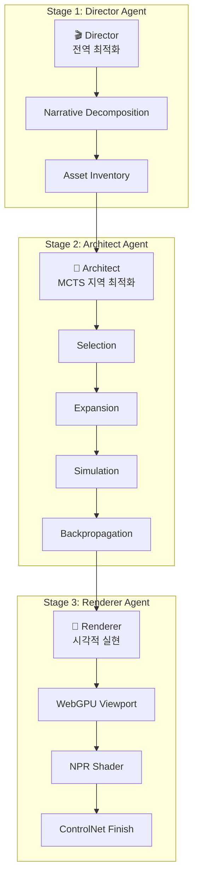

# 3D 웹툰 및 인터랙티브 스토리텔링 에이전트: 심층 분석 및 실행 설계서

## 1. 레퍼런스 분석 및 설계 검증 (Reference Analysis & Validation)

2024-2025년의 핵심 연구인 **SceneCraft**, **Holodeck**, 그리고 WebPilot의 MCTS 아키텍처를 교차 분석한 결과입니다.

### 1.1 현행 파이프라인(ai_scene_pipeline_redesign)의 타당성

| 항목 | 결과 |
|------|------|
| **검증 결과** | ✅ **적합** |
| **근거** | LLM의 추론 + MCTS 최적화 결합은 Holodeck가 증명한 가장 확실한 해결책 |

> **참고:** Holodeck는 GPT-4로 공간 제약 조건(Constraints)을 생성하고, 최적화 알고리즘으로 가구를 배치하여 인간 디자이너보다 선호도가 높은 씬을 생성했습니다.

### 1.2 경쟁 기술 대비 차별화 전략

| 기술 요소 | 기존 방식 (Baseline) | 제안된 개선안 (Advanced) |
|-----------|---------------------|-------------------------|
| **장면 구성** | LLM이 좌표를 직접 예측 (오류 높음) | **MCTS 기반 레이아웃 탐색** (충돌 방지) |
| **에셋 생성** | 텍스트로 매번 새로 생성 | **검색(Retrieval) + 생성(GenAI) 하이브리드** |
| **렌더링** | 서버 사이드 렌더링 (지연 발생) | **WebGPU 클라이언트 실시간 렌더링** |
| **스타일** | 프롬프트 의존 (일관성 부족) | **3D Geometry + ControlNet** (구조적 일관성) |

---

## 2. 상세 아키텍처 설계: The "Director-Architect-Renderer" Triad

영화 제작 파이프라인을 모방한 3개의 전문화된 에이전트 그룹으로 구성됩니다.



### 2.1 Stage 1: The Director Agent (전역 최적화)

사용자의 모호한 시나리오를 구체적인 **장면 명세서(Scene Specification)**로 변환합니다.

**입력 예시:**
> "주인공이 낡은 탐정 사무소에서 비 오는 창밖을 보며 담배를 피우고 있다."

**핵심 로직:**

1. **Narrative Decomposition:** [공간 정보], [조명/분위기], [캐릭터 연기], [카메라 워크]로 분해
2. **Asset Inventory:** 필요한 소품 리스트를 JSON으로 추출

**출력 (JSON Schema):**

```json
{
  "scene_id": "ep1_sc4",
  "atmosphere": "noir_rainy",
  "objects": ["vintage_desk", "leather_sofa", "ashtray"],
  "character_action": "smoking_near_window",
  "camera": "medium_shot_profile"
}
```

---

### 2.2 Stage 2: The Architect Agent (지역 최적화 - MCTS)

> 🔥 **이 프로젝트의 기술적 해자(Moat)**

추상적인 위치("창가에")를 물리적으로 타당한 (x, y, z) 좌표와 회전값으로 변환합니다.

**MCTS(Monte Carlo Scene Search) 프로세스:**

| 단계 | 동작 |
|------|------|
| **1. Selection** | 가장 불확실성이 높은 오브젝트 선택 |
| **2. Expansion** | LLM 제안 기반 여러 후보 좌표 샘플링 |
| **3. Simulation** | 충돌 여부 + 접근성 시뮬레이션 |
| **4. Backpropagation** | 충돌 없고 미적으로 우수한 배치에 높은 점수 부여 |

**기술 스택:** Python (Backend), NumPy (연산), Objaverse (에셋 라이브러리)

---

### 2.3 Stage 3: The Renderer Agent (시각적 실현)

확정된 3D 레이아웃을 웹 브라우저에서 시각화하고, 웹툰 스타일로 렌더링합니다.

| 단계 | 기술 | 목적 |
|------|------|------|
| **WebGPU 뷰포트** | Three.js WebGPURenderer | 대용량 3D 씬 60fps 구동 |
| **NPR** | Toon Shader | 1차적인 만화 느낌 |
| **Style Transfer** | ControlNet + LoRA | 작가 화풍 최종 적용 |

---

## 3. 구체적인 작업 지시서 (Work Instructions)

프로젝트 팀원들에게 즉시 할당할 수 있는 단계별 작업 내역입니다.

### Phase 1: 기반 인프라 및 데이터 파이프라인 (Week 1-2)

#### [Data] 3D Asset Database 구축

- **목표:** 텍스트 검색이 가능한 3D 에셋 라이브러리 구축
- **Action:**
  - Objaverse 데이터셋 중 고품질 에셋 1,000개 선별
  - Vector DB(Weaviate/Chroma)에 인덱싱
  - CLIP을 사용하여 텍스트-3D 매칭 모델 연결

#### [Frontend] WebGPU 뷰어 프로토타이핑

- **목표:** 브라우저에서 GLTF/GLB 로드 및 조명 제어
- **Action:**
  - Three.js + WebGPURenderer 기본 씬 뷰어 구현
  - OrbitControls + TransformControls 적용

---

### Phase 2: MCTS 레이아웃 엔진 구현 (Week 3-5)

#### [AI/Algo] 제약 조건 해석기(Constraint Solver) 개발

- **목표:** 자연어를 수학적 제약식으로 변환
- **Action:**
  - `RelativePosition(obj_A, obj_B, relation)` 함수 작성
  - Trimesh 등 간이 물리 엔진 연동

#### [AI/Algo] MCTS 루프 구현

- **목표:** 최적의 배치를 찾는 탐색 알고리즘
- **Action:**
  - State: 현재 씬 그래프
  - Action: 물체 추가/이동
  - Reward: 제약조건 만족도 + 충돌 없음

---

### Phase 3: 렌더링 및 스타일 트랜스퍼 (Week 6-8)

#### [Graphics] NPR 쉐이더 작성

- **목표:** 실시간 만화 외곽선 및 톤
- **Action:**
  - WebGPU WGSL로 Sobel Filter + Cel Shading 구현

#### [AI/Model] ComfyUI API 연동

- **목표:** 3D 씬을 고품질 일러스트로 변환
- **Action:**
  - 파이프라인: WebGPU 스크린샷 → ControlNet → SD LoRA → Result

---

## 4. 예상 리스크 및 해결 방안 (Risk Management)

### 4.1 지연 시간 (Latency)

| 문제 | 해결책 |
|------|--------|
| MCTS 탐색과 3D 렌더링이 무거움 | **계층적 탐색(Hierarchical Search)** 도입 + **Semantic Cache**로 유사 요청 재사용 |

### 4.2 3D 에셋의 이질감

| 문제 | 해결책 |
|------|--------|
| 서로 다른 소스의 3D 모델 스타일 불일치 | 3D는 형태/깊이 정보만 제공, 최종 텍스처링은 **ControlNet + IP-Adapter**가 통일 스타일로 덮어씌움 |

---

## 5. 결론

이 설계안은 프로젝트를 단순한 '자동화 도구'에서 **'공간 지능을 갖춘 AI 감독'**으로 격상시킬 것입니다.

> **권장:** 지금 바로 Phase 1의 데이터베이스 구축부터 시작하시기를 권장합니다.

---

## 6. 참고 자료

1. WebPilot: A Versatile and Autonomous Multi-Agent System for Web Task Execution with Strategic Exploration - [arXiv](https://arxiv.org/html/2408.15978v1)
2. Implementing Semantic Caching in RAG Using Redis for Faster Responses - [Medium](https://medium.com/@yashpaddalwar/implementing-semantic-caching-in-rag-using-redis-for-faster-responses-b901bcc8324b)

---

## 7. 관련 문서

- [ai_scene_pipeline_redesign.md](./ai_scene_pipeline_redesign.md) - AI-Native 7단계 파이프라인 상세 설계
- [ai_scene_pipeline_webtoon_automation.md](./ai_scene_pipeline_webtoon_automation.md) - 4단계 자동화 아키텍처
- [webpilot_2_0_design.md](./webpilot_2_0_design.md) - 자율형 공간 서사 엔진 기술 사양서
