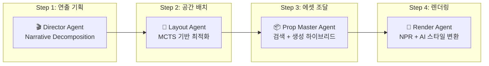

# AI Scene Pipeline Redesign: 3D 웹툰 및 인터랙티브 스토리텔링 자동화 아키텍처

## 1. 설계 검증 및 유효성 분석 (Validation)

AI Scene Pipeline Redesign의 핵심은 **"LLM의 환각(Hallucination)을 제어하고, 물리적/공간적 정합성을 보장하는 3D 장면 생성"**에 있습니다. 분석 결과, 이 방향성은 현재 학계와 산업계의 최신 트렌드인 **'공간 지능(Spatial Intelligence)'** 및 **'에이전트 기반 워크플로우(Agentic Workflow)'**와 정확히 일치합니다.

### 1.1 왜 이 설계가 옳은가? (Why it works)

| 문제 영역 | 해결 방식 | 근거 |
|-----------|-----------|------|
| **LLM의 공간적 한계** | MCTS(몬테카를로 트리 검색) 기반 지역 최적화 | Scenethesis, LGMCTS 연구에서 입증된 SOTA 방식 |
| **웹툰 제작 병목** | 3D 에셋 기반 배경/컷 자동화 | Tooning 플랫폼의 방향성과 일치 |
| **일관성 문제** | 3D 기반 렌더링 + ControlNet 파이프라인 | 일관된 캐릭터 생성을 위한 유일한 실용적 해법 |

---

## 2. 상세 아키텍처 설계 (Detailed Architecture Design)

본 설계는 WebPilot의 **이중 최적화(Dual Optimization)** 철학을 계승하여, **전역적 연출(Global Director)**과 **국소적 배치(Local Builder)**로 역할을 분리합니다.

### 2.1 전체 파이프라인 개요 (The 4-Stage Pipeline)



| 단계 | 모듈명 | 담당 에이전트 | 핵심 기술 |
|------|--------|---------------|-----------|
| **Step 1** | Narrative Decomposition | 🎬 **Director Agent** | LLM (Claude/GPT-4o), RAG |
| **Step 2** | Spatial Layout Optimization | 📐 **Layout Agent** | **MCTS**, Scene Graph |
| **Step 3** | Asset Management | 📦 **Prop Master Agent** | Vector DB, GenAI 3D (Meshy/Tripo) |
| **Step 4** | Rendering & Style Transfer | 🎨 **Render Agent** | **WebGPU**, Three.js, ControlNet |

---

### 2.2 각 단계별 상세 로직

#### Step 1. Narrative Decomposition (전역 최적화: 연출 기획)

사용자의 대본(Script)을 입력받아 시각적 연출 지시서로 변환하는 단계입니다.

**입력 예시:**
> "주인공이 비 오는 날 사이버펑크 카페 창가에 앉아 우울하게 밖을 보고 있다."

**Director Agent의 역할:**

1. **장면 분해:** 문장을 3D 요소(주인공, 카페 의자, 창문, 비 효과)와 분위기(조명: 네온, 블루 톤)로 분해
2. **카메라 워크 설정:** 텍스트의 정서(우울함)를 분석하여 카메라 구도 결정
3. **JSON 출력:** 에이전트 간 통신을 위한 표준화 포맷

```json
{
  "scene_id": "ep1_cut4",
  "atmosphere": "cyberpunk_rainy",
  "camera": {"type": "shoulder_shot", "target": "hero_face"},
  "objects": [
    {"id": "hero", "pose": "sitting_chin_hand", "emotion": "melancholic"},
    {"id": "table_round", "material": "metal_scratched"},
    {"id": "neon_sign", "text": "OPEN", "color": "pink"}
  ]
}
```

---

#### Step 2. Spatial Layout Optimization (지역 최적화: 공간 배치)

> **🔥 본 리디자인의 핵심 차별점**

LLM이 생성한 모호한 위치 정보("창가에")를 물리적으로 타당한 3D 좌표로 변환합니다.

**문제:** LLM은 물체가 겹치거나(Collision), 공중에 뜨는 물리 오류를 자주 범함

**해결책: MCTS 기반 레이아웃 탐색**

```
┌─────────────────────────────────────────────────────────────┐
│  1. 노드 확장 (Expansion)                                   │
│     가능한 가구 배치 조합 시뮬레이션                          │
│     예: 의자를 탁자 앞 50cm, 60cm, 70cm에 배치              │
├─────────────────────────────────────────────────────────────┤
│  2. 평가 (Evaluation)                                       │
│     • 물리적 타당성 (충돌 없음) 점수화                       │
│     • 미적 구도 (3분할 법칙) 점수화                          │
├─────────────────────────────────────────────────────────────┤
│  3. 역전파 (Backpropagation)                                │
│     가장 점수가 높은 배치 경로 선택 및 확정                   │
└─────────────────────────────────────────────────────────────┘
```

**결과:** 사람이 배치한 것처럼 자연스럽고 기능적인 3D Scene Graph 생성

---

#### Step 3. Asset Management (에셋 조달 및 생성)

확정된 레이아웃에 실제 3D 모델을 배치합니다. 속도와 품질의 균형을 위해 **하이브리드 방식** 사용.

| 방식 | 설명 | 사용 시점 |
|------|------|-----------|
| **Retrieval (검색)** | Vector DB에서 고품질 에셋 라이브러리 조회 | 일반 소품 (의자, 컵 등) |
| **Generation (생성)** | Meshy/TripoSR API로 실시간 생성 | 고유한 객체 |
| **Character Binding** | VRM 모델 + Mixamo 애니메이션 리타겟팅 | 주인공 캐릭터 |

---

#### Step 4. Rendering & Style Transfer (최종 렌더링)

3D 장면을 웹툰 스타일의 2D 이미지로 변환합니다.

**파이프라인:**

1. **WebGPU/Three.js 뷰포트:** 브라우저에서 실시간 3D 장면 구성, 카메라 앵글 수정 가능
2. **NPR (Non-Photorealistic Rendering):** 툰 쉐이딩 적용
3. **AI Style Refinement:** ControlNet (Canny/Depth) + Webtoon Style LoRA로 최종 변환

---

## 3. 기술 스택 및 구현 전략 (Tech Stack)

| 구분 | 추천 기술 | 선정 이유 |
|------|-----------|-----------|
| **Orchestration** | **LangGraph** | 에이전트 간 순환적(Cyclic) 작업 흐름과 상태 관리에 최적화 |
| **Backend** | **Python (FastAPI)** | MCTS 알고리즘 연산 및 PyTorch 기반 모델 서빙 |
| **Frontend** | **React + Three.js (R3F)** | 웹 기반 인터랙티브 3D 뷰어, WebGPU 지원 |
| **3D Gen Model** | **TripoSR / Meshy API** | 속도와 메쉬 품질의 균형 |
| **Rendering AI** | **ComfyUI (API Mode)** | 복잡한 이미지 생성 파이프라인 구성 및 API화 |

---

## 4. 예상되는 기술적 난관 및 해결책 (Risk & Mitigation)

### 4.1 지연 시간 (Latency)

| 문제 | 해결책 |
|------|--------|
| 3D 생성과 렌더링 시간이 오래 걸림 | **Latte3D** Amortized Optimization 도입 또는 **Billboarding 기법** 혼용 (목표: 400ms) |

### 4.2 캐릭터 일관성 (Identity Consistency)

| 문제 | 해결책 |
|------|--------|
| 컷마다 얼굴이 달라지는 현상 | **3D VRM 모델** 베이스 + **Img2Img + Depth ControlNet** 방식 적용 |

### 4.3 복잡한 상호작용 (Complex Interaction)

| 문제 | 해결책 |
|------|--------|
| "컵을 손에 쥐고 있다" 같은 정밀한 상호작용 | 에셋 메타데이터에 **Affordance Map** (접촉점 정의) 포함 |

---

## 5. 결론

이 설계는 **'자율형 3D 웹툰 에이전트'**를 실현하기 위한 가장 현실적이고 강력한 청사진입니다.

WebPilot의 분석 능력을 3D 공간 지능으로 확장함으로써, 기존 툴들이 해결하지 못한 **'연출의 자동화'**를 달성할 수 있습니다.

---

## 6. 관련 문서

- [ai_scene_pipeline_redesign.md](./ai_scene_pipeline_redesign.md) - AI-Native 7단계 파이프라인 상세 설계
- [webpilot_2_0_design.md](./webpilot_2_0_design.md) - 자율형 공간 서사 엔진 기술 사양서
- [3d_webtoon_design.md](./3d_webtoon_design.md) - 3D 웹툰 렌더링 파이프라인
