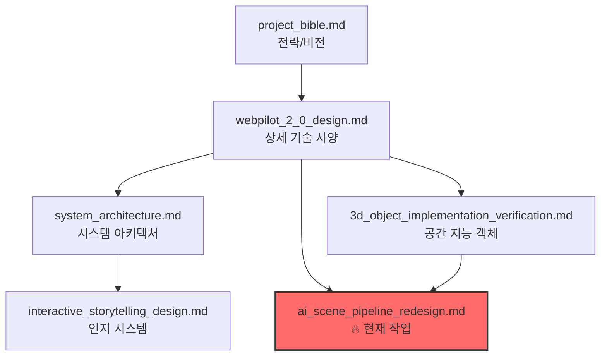

# WebPilot Engine 설계 문서 인덱스

WebPilot Engine의 핵심 설계 문서들을 체계적으로 정리한 인덱스입니다.

---

## 1. 핵심 설계 문서 (현재 진행 중)

| 문서 | 주요 내용 | 상태 |
|------|-----------|------|
| [ai_scene_pipeline_redesign.md](./ai_scene_pipeline_redesign.md) | AI-Native Scene Generation 7단계 파이프라인 전면 재설계 | 🔥 진행 중 |
| [ai_scene_pipeline_webtoon_automation.md](./ai_scene_pipeline_webtoon_automation.md) | 3D 웹툰 및 인터랙티브 스토리텔링 4단계 자동화 파이프라인 (MCTS 기반) | ✅ 완료 |
| [ai_scene_agent_deep_dive.md](./ai_scene_agent_deep_dive.md) | Director-Architect-Renderer 에이전트 심층 분석 및 8주 작업 지시서 | ✅ 완료 |

---

## 2. 시스템 아키텍처

| 문서 | 주요 내용 |
|------|-----------|
| [system_architecture.md](./system_architecture.md) | WebPilot Engine v2.0 전체 시스템 아키텍처, 인지 엔진, 생성형 3D 파이프라인, GSCP, 공간 지능형 객체 설계 |
| [webpilot_2_0_design.md](./webpilot_2_0_design.md) | 안티그라비티 기반 자율형 공간 서사 엔진 상세 기술 사양서, 멀티 에이전트 오케스트레이션 |

---

## 3. AI 및 인지 시스템

| 문서 | 주요 내용 |
|------|-----------|
| [3d_object_implementation_verification.md](./3d_object_implementation_verification.md) | 공간 지능형 객체 구현 검증 보고서 (UUIDv7, Transient Updates, VLM 기반 물리 추론, Dynamic Batching) |
| [interactive_storytelling_design.md](./interactive_storytelling_design.md) | 교육용 ITS 프레임워크 분석 (LangGraph, 역할 기반 에이전트, MCP, R3F 시각화) |

---

## 4. 프로젝트 전략 및 비전

| 문서 | 주요 내용 |
|------|-----------|
| [project_bible.md](./project_bible.md) | 멀티모달 스토리버스 + WebPilot 융합 전략, MCP 기반 하이브리드 아키텍처, 33개월 로드맵 |

---

## 5. 구현 및 검증

| 문서 | 주요 내용 |
|------|-----------|
| [3d_platform_enhancement.md](./3d_platform_enhancement.md) | 3D 플랫폼 고도화 기술 문서 |
| [3d_webtoon_design.md](./3d_webtoon_design.md) | 3D 웹툰 설계 및 렌더링 파이프라인 |
| [project_analysis.md](./project_analysis.md) | 프로젝트 분석 리포트 |
| [project_analysis_improvement.md](./project_analysis_improvement.md) | 프로젝트 개선 분석 상세 문서 |

---

## 6. 문서 간 연관 관계

---

## 7. 핵심 기술 키워드 맵

### 아키텍처 관련

- **MCP (Model Context Protocol)**: 에이전트 간 통신 프로토콜
- **GSCP (Generative Spatial Content Platform)**: 생성형 공간 콘텐츠 플랫폼
- **R3F (React Three Fiber)**: 선언적 3D 렌더링

### AI/ML 관련

- **VLM 기반 물리 추론**: Gemini를 활용한 3D 객체 물리 속성 추론
- **Dynamic Batching**: API 호출 효율화를 위한 배치 처리
- **Semantic Scene Graph**: 의미론적 장면 그래프

### 데이터 관련

- **UUIDv7**: 시간 정렬 가능한 분산 ID 체계
- **World Bible**: 세계관 지식 온톨로지 (JSON-LD)
- **Transient Updates**: 고빈도 업데이트 패턴

---

## 8. 버전 히스토리

| 버전 | 날짜 | 변경 내용 |
|------|------|-----------|
| v1.0 | 2026-01-28 | 초기 인덱스 문서 작성 |

---

> **참고**: 이 문서는 프로젝트 설계 문서의 네비게이션 허브 역할을 합니다. 각 문서의 상세 내용은 해당 링크를 참조하세요.
