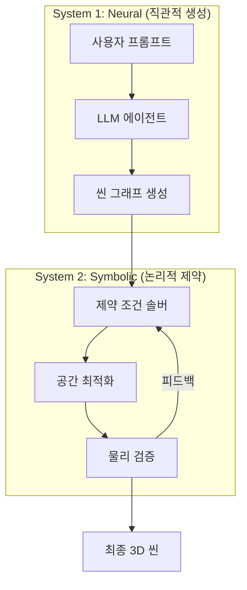
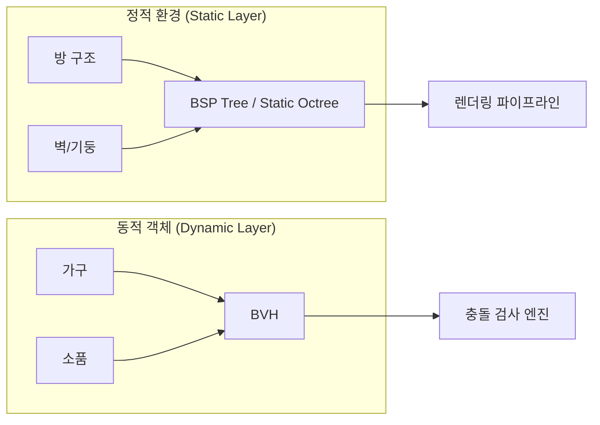
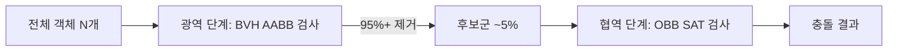
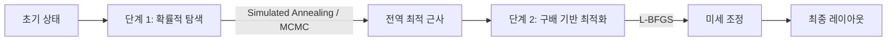
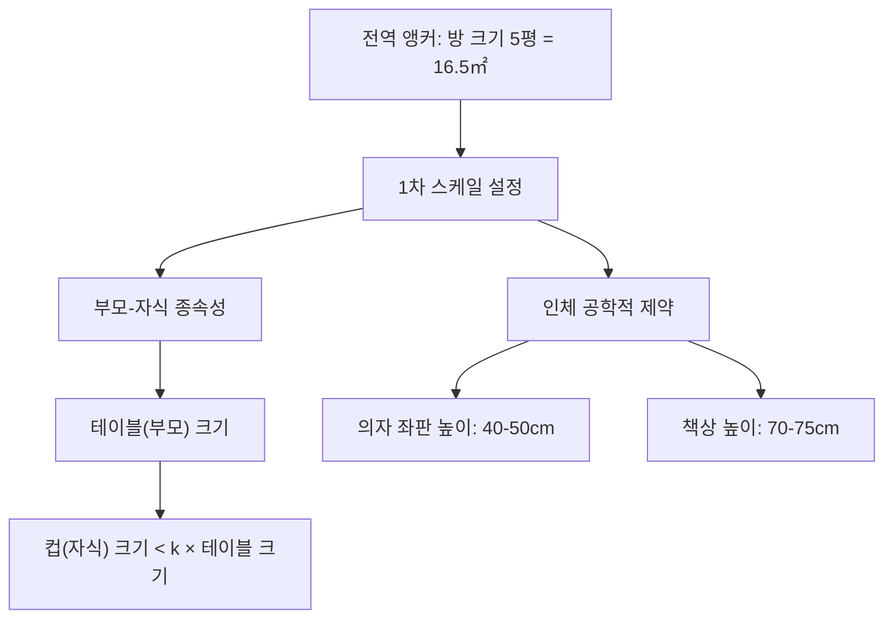

# 텍스트 기반 3D 씬 생성의 물리적 정합성 확보를 위한 뉴로-심볼릭 아키텍처 및 공간 연산 시스템 상세 설계

> **작성일**: 2026-01-29  
> **프로젝트**: WebPilot Engine  
> **문서 유형**: 핵심 아키텍처 설계 문서  
> **버전**: v1.0

---

## 1. 서론: 생성형 AI의 다음 프런티어, '물리적 공간'으로의 확장

인공지능 기술은 텍스트와 2D 이미지를 생성하는 수준을 넘어, 이제 3차원 공간 자체를 창조하는 **'텍스트-투-월드(Text-to-World)'**의 영역으로 진입하고 있습니다. 사용자가 "오후의 햇살이 비치는 아늑한 북유럽 스타일의 서재"라는 한 줄의 텍스트를 입력했을 때, 시스템이 기하학적으로 완벽하고 물리적으로 타당하며 상호작용 가능한 3D 환경을 즉시 구축하는 것은 메타버스, 게임 개발, 건축 시뮬레이션, 로보틱스 훈련 등 다양한 산업 분야의 궁극적인 목표입니다.

이러한 기술적 비전은 단순히 시각적으로 그럴듯한 이미지를 생성하는 것을 넘어, 가상 세계 내의 모든 객체가 물리 법칙에 부합하는 위치, 크기, 관계를 갖도록 하는 고도의 정합성을 요구합니다.

### 현재 생성형 모델의 본질적 한계

그러나 현재 주류를 이루고 있는 생성형 모델, 특히 확산 모델(Diffusion Models)이나 대규모 언어 모델(LLM) 기반의 접근 방식은 본질적인 한계를 드러내고 있습니다:

- **텍스트 생성 모델**: 3차원 좌표계와 부피에 대한 내재적 이해가 부족
- **2D 이미지 생성 모델**: 원근법적 투영(Projection)의 결과물만을 학습했을 뿐 깊이(Depth)와 물리적 충돌(Collision)에 대한 개념을 학습하지 못함

이로 인해 생성된 3D 씬에서는 다음과 같은 기이한 현상이 빈번하게 발생합니다:

| 현상 | 설명 |
|------|------|
| **Interpenetration** | 가구가 벽을 뚫고 들어감 |
| **Gravity Violation** | 중력을 무시하고 공중에 떠 있음 |
| **Scale Ambiguity** | 커피잔이 테이블만 하게 생성됨 |

> [!CAUTION]
> 이러한 **'공간 인식의 부재(Spatial Awareness Deficit)'**와 **'상대적 스케일 오류(Relative Scale Error)'**는 단순한 시각적 결함을 넘어, 물리 엔진이 적용된 시뮬레이션 환경에서는 시스템의 안정성을 붕괴시키는 치명적인 요인으로 작용합니다.

### 본 보고서의 목적

본 보고서는 이러한 난제들을 해결하고 **'텍스트 한 줄로 완벽한 세상 구현'**이라는 목표를 달성하기 위해, 신경망 기반의 의미론적 추론(Neural Semantic Reasoning)과 기하학적 제약 조건 해결(Geometric Constraint Solving)을 결합한 통합 시스템의 상세 설계를 제안합니다.

우리는 단순히 기존의 알고리즘을 나열하는 수준을 넘어, **대규모 언어 모델의 세계 지식(World Knowledge)**을 정교한 공간 분할 알고리즘(Spatial Partitioning) 및 충돌 감지 파이프라인(Collision Detection Pipeline)과 융합하는 **'뉴로-심볼릭(Neuro-Symbolic)'** 아키텍처를 제시합니다.

---

## 2. 문제 공간의 심층 분석: AI가 직면한 기하학적 문맹

완벽한 3D 세상을 구현하기 위해서는 현재 AI 모델들이 겪고 있는 **기하학적 문맹(Geometric Illiteracy)**의 원인을 근본적으로 파헤쳐야 합니다. 이는 데이터의 부족 문제가 아니라, **표현 방식(Representation)**과 **추론 방식(Reasoning)**의 구조적 불일치에서 기인합니다.

### 2.1. 의미론적 공간과 유클리드 공간의 괴리

인간의 언어는 고도로 압축된 상징 체계입니다. "책상 위에 컴퓨터가 있다"라는 문장에서 '위(on)'라는 전치사는 두 객체 간의 **접촉(Contact)**과 **지지(Support)** 관계를 내포하지만, 구체적인 좌표(x, y, z)나 접촉 면적에 대한 정보는 생략되어 있습니다.

대규모 언어 모델(LLM)은 텍스트 코퍼스에서 단어 간의 확률적 연관성을 학습하여 문법적으로 완벽한 문장을 생성할 수 있지만, '위'라는 단어가 3차원 유클리드 공간에서 **중력 벡터와 반대 방향으로 작용하는 수직 항력(Normal Force)**을 의미한다는 사실은 이해하지 못합니다.

> [!WARNING]
> 별도의 해석 레이어 없이 LLM의 출력을 3D 좌표로 직접 변환하려는 시도는 필연적으로 물리적 모순을 야기합니다.

**예시**: 모델은 책상과 컴퓨터의 중심 좌표를 동일하게 설정하여 두 물체가 서로 겹쳐버리는(Clipping) 결과를 초래할 수 있습니다.

### 2.2. 상대적 스케일의 모호성과 데이터 편향

객체의 크기(Scale)는 절대적인 값이 아니라, 환경과 문맥에 따라 달라지는 **상대적인 값**입니다.

- "거대한"이라는 형용사가 '개미' 앞에 붙을 때와 '빌딩' 앞에 붙을 때의 물리적 치수 차이는 엄청남
- 기존의 3D 생성 모델들은 학습 데이터셋(예: SUN RGB-D, ShapeNet)에 존재하는 객체들의 절대적인 크기 분포에 의존

**2D→3D 스케일 모호성 문제**:

- 원근법으로 인해 카메라 가까이에 있는 작은 물체가 멀리 있는 큰 물체보다 크게 보일 수 있음
- 이러한 시각적 정보만으로는 객체의 실제 크기를 정확히 추정하기 어려움

**결과**: 1인용 소파가 3인용 침대보다 크게 배치되거나, 문 손잡이가 사람 머리보다 크게 생성되는 등 현실감을 해치는 스케일 오류 발생

### 2.3. 계산 복잡도와 실시간 충돌 처리의 난제

수천 개의 객체로 구성된 복잡한 씬에서 모든 객체 간의 충돌을 검사하는 것은 계산적으로 매우 비싼 작업입니다.

| 방식 | 시간 복잡도 | 객체 1,000개 기준 |
|------|------------|------------------|
| Brute-force | $O(N^2)$ | 1,000,000 연산 |
| BVH 기반 | $O(N \log N)$ | ~10,000 연산 |

실시간 렌더링이나 인터랙티브 환경 구축을 위해서는 **프레임당 수 밀리초(ms) 이내**에 연산을 완료해야 하지만, 생성형 모델은 이러한 최적화 문제를 고려하지 않고 객체를 배치하는 경우가 많습니다.

> [!IMPORTANT]
> 효율적인 공간 분할(Spatial Partitioning) 데이터 구조 없이는 시스템의 속도가 기하급수적으로 느려지게 됩니다. 이는 **'즉각적인 세상 생성'**이라는 사용자 경험을 저해하는 주요 병목 구간입니다.

---

## 3. 핵심 솔루션 아키텍처: 뉴로-심볼릭 하이브리드 접근

우리는 상기한 문제들을 해결하기 위해 **'뉴로-심볼릭(Neuro-Symbolic)'** 아키텍처를 제안합니다. 이 아키텍처는 신경망(Neural Networks)의 직관적이고 유연한 생성 능력(**System 1**)과 심볼릭 AI(Symbolic AI)의 논리적이고 엄격한 제약 조건 처리 능력(**System 2**)을 결합한 형태입니다.



### 3.1. 파이프라인 1: 의미론적 파싱 및 씬 그래프 생성 (The Semantic Core)

첫 번째 단계는 사용자의 모호한 텍스트 입력을 기계가 이해할 수 있는 명시적인 **중간 표현(Intermediate Representation)**으로 변환하는 것입니다. 이를 위해 **씬 그래프(Scene Graph)** 구조를 채택합니다.

#### 씬 그래프 정의

$$G = (O, R)$$

여기서:

- $O$는 객체(Node)들의 집합
- $R$은 객체 간의 관계(Edge)를 나타냄

#### LLM 에이전트의 출력 구조

```typescript
// 객체 노드
{
    id: "chair_01",
    class: "chair",
    attributes: ["wooden", "vintage"],
    scale_prior: "normal"
}

// 관계 엣지
{
    source: "chair_01",
    target: "floor",
    type: "supported_by"
},
{
    source: "chair_01",
    target: "table_01",
    type: "facing"
}
```

> [!NOTE]
> 이 과정에서 LLM은 단순히 텍스트에 명시된 정보뿐만 아니라, **상식적 추론(Commonsense Reasoning)**을 통해 암묵적인 제약 조건을 명시화해야 합니다.

**예시**: "공부방"이라는 단어에서 추론되는 공간적 관계:

- "책상은 바닥 위에 있다"
- "의자는 책상을 향해 있다"
- "책장은 벽에 붙어 있다"

### 3.2. 파이프라인 2: 기하학적 레이아웃 및 제약 조건 해결 (The Geometric Solver)

생성된 씬 그래프는 추상적인 관계만을 담고 있으므로, 이를 구체적인 3D 좌표와 회전값, 크기(Transform: Position, Rotation, Scale)로 변환하는 과정이 필요합니다.

이 단계는 **제약 조건 만족 문제(CSP, Constraint Satisfaction Problem)**로 정의됩니다.

**제약 조건 유형**:

1. 충돌 없음 (Non-collision)
2. 지지 관계 (Support)
3. 의미론적 배치 (예: TV는 소파 맞은편)

**최적화 기법**:

- 확률적 최적화 알고리즘 (예: Simulated Annealing)
- 미분 가능한 물리 엔진 (Differentiable Physics Engine)

### 3.3. 파이프라인 3: 물리적 검증 및 공간 최적화 (The Physics Validator)

레이아웃이 결정된 후에는 실제 3D 메쉬(Mesh) 데이터를 로드하고, 미세한 충돌이나 물리적 오류가 없는지 정밀 검증을 수행합니다.

**사용 기술**:

- BVH (Bounding Volume Hierarchy)
- Octree

**반복적 정제(Iterative Refinement)**:
만약 물리적 충돌이 감지되면, 시스템은 해당 정보를 다시 제약 조건 솔버로 피드백하여 객체의 위치를 미세 조정하거나 스케일을 변경합니다.

---

## 4. 상세 설계: 공간 데이터 구조 및 충돌 처리 엔진

물리적으로 타당한 '완벽한 세상'을 구현하는 데 있어 가장 핵심적인 엔지니어링 과제는 수천, 수만 개의 객체가 존재하는 공간을 효율적으로 관리하고 충돌을 감지하는 것입니다.

### 4.1. 공간 분할 자료구조의 비교 분석 및 선정

3D 공간을 효율적으로 탐색하기 위한 자료구조는 크게 두 가지 방식으로 나뉩니다:

- **공간 분할(Space Partitioning)** 방식
- **객체 분할(Object Partitioning)** 방식

#### 4.1.1. 옥트리(Octree)

3차원 공간을 재귀적으로 8개의 동일한 정육면체(Octant)로 분할하는 방식입니다.

| 장점 | 단점 |
|------|------|
| 구현이 비교적 직관적 | 객체 분포가 불균일하면 불균형 발생 |
| 정적 지형 처리에 효율적 | 동적 객체 이동 시 업데이트 비용 |
| 빈 공간 빠른 스킵 | 노드 경계선 처리 까다로움 |

#### 4.1.2. 이진 공간 분할(BSP) 트리

임의의 평면(Hyperplane)을 사용하여 공간을 재귀적으로 이분할하는 방식입니다.

| 장점 | 단점 |
|------|------|
| 폴리곤 렌더링 순서 결정에 탁월 | 트리 생성 과정이 느리고 복잡 |
| 실내 건축 구조 표현에 효율적 | 분할 평면 결정이 NP-hard에 근접 |
| 가시성 판별에 유리 | 동적 객체 처리에 부적합 |

#### 4.1.3. 바운딩 볼륨 계층 구조(BVH)

공간을 나누는 것이 아니라, 객체들을 감싸는 볼륨(Bounding Volume)을 계층적으로 그룹화하는 방식입니다.

| 장점 | 단점 |
|------|------|
| 빈 공간에 메모리 낭비 없음 | 볼륨 중첩으로 탐색 효율 저하 가능 |
| 동적 객체 처리에 강력 | 좋은 분할 전략 필요 |
| Refitting만으로 업데이트 가능 | |

#### 4.1.4. 전략적 선택: 정적-동적 분리 하이브리드 구조

> [!IMPORTANT]
> **이중 계층(Dual-Layer) 하이브리드 아키텍처 채택**



- **정적 환경**: BSP 트리 또는 정적 Octree → 렌더링 가시성 판단 최적화
- **동적 객체**: BVH → 실시간 충돌 검사 및 레이아웃 최적화

### 4.2. 고성능 BVH 구축 및 최적화 전략

BVH의 성능은 트리를 어떻게 구축하느냐에 따라 극적으로 달라집니다.

#### 4.2.1. 표면적 경험 법칙(SAH, Surface Area Heuristic)

단순히 공간을 반으로 나누는 것(Spatial Median)이나 객체 수의 중간값으로 나누는 것(Object Median)은 최적의 트리를 보장하지 않습니다.

**SAH 핵심 아이디어**: "노드의 표면적이 작을수록 레이(Ray)나 다른 객체와 충돌할 확률이 낮다"

**비용 함수**:

$$Cost(C) = C_{trav} + P(L) \cdot C_{isect}(L) + P(R) \cdot C_{isect}(R)$$

여기서:

- $C_{trav}$: 노드 순회 비용
- $P(L), P(R)$: 왼쪽/오른쪽 자식 노드 방문 확률 (부모 노드 표면적 대비 자식 노드 표면적 비율)
- $C_{isect}$: 자식 노드 내 프리미티브와 교차 검사 비용

#### 4.2.2. 선형 BVH (LBVH) 및 GPU 가속

수만 개의 객체를 다룰 때 CPU만으로는 트리 구축 속도에 한계가 있습니다.

**LBVH 알고리즘 (GPU/CUDA 병렬 구축)**:

1. 각 객체의 중심 좌표를 **모턴 코드(Morton Code, Z-order Curve)**로 변환하여 1차원 정수로 매핑
2. 모턴 코드를 기준으로 객체들을 **Radix Sort**로 정렬
3. 정렬된 리스트를 기반으로 계층 구조 생성

**적응형 전략**:

- 초기 배치 시: 정밀한 SAH BVH 사용
- 실시간 상호작용 중: LBVH 사용

### 4.3. 충돌 감지 파이프라인 (Collision Detection Pipeline)

효율적인 배치를 위해 충돌 감지는 **2단계**로 수행됩니다.



#### 4.3.1. 광역 단계 (Broad Phase)

**목적**: 잠재적 충돌군(Potentially Colliding Set) 선별

- BVH 트리 순회하며 **AABB(Axis-Aligned Bounding Box)** 겹침 검사
- AABB 교차 검사는 단순한 좌표 비교만으로 수행: $x_{min} < x'_{max}$ 등
- 이 단계에서 충돌 가능성이 없는 **95% 이상의 객체 쌍을 제거**

#### 4.3.2. 협역 단계 (Narrow Phase)

**목적**: 정밀 충돌 검사

**AABB의 한계와 OBB의 필요성**:

```
AABB (회전된 소파):           OBB (회전된 소파):
┌─────────────────────┐      ╱─────────────╲
│     ░░░░░░░        │      ░░░░░░░░░░░░░░░
│   ░░░░░░░░░░░      │      ╲─────────────╱
│     ░░░░░░░        │
└─────────────────────┘
   ↑ Dead Space 포함         ↑ Tight Fit
```

**분리 축 정리(SAT, Separating Axis Theorem)**:

3차원 OBB의 경우, 다음 **15개의 축**만 검사하면 충돌 여부를 완벽하게 판별:

- 각 OBB의 3개 면 법선 벡터(Face Normals): 6개
- 9개의 엣지 외적 벡터(Edge Cross Products): 9개

#### 4.3.3. 연속 충돌 감지(CCD)와 터널링 방지

**터널링(Tunneling)**: 얇은 물체나 빠르게 이동하는 물체가 한 프레임 사이에 벽을 뚫고 지나가 충돌이 감지되지 않는 현상

**해결책**: 연속 충돌 감지(CCD, Continuous Collision Detection)

- 물체의 이전 프레임 위치와 현재 프레임 위치를 잇는 **궤적(Swept Volume)** 생성
- 이 볼륨이 다른 물체와 교차하는지 검사
- 시간 $t$와 $t+1$ 사이의 충돌을 놓치지 않고 감지

---

## 5. 상세 설계: 제약 조건 해결 및 상대적 스케일 추론

공간 데이터 구조가 씬의 '뼈대'라면, **제약 조건 해결(Constraint Solving)**은 씬의 '형태'를 결정하는 근육입니다.

### 5.1. Rubik 공간 제약 솔버

반복적(Iterative) 접근 방식을 통해 최적의 레이아웃을 찾습니다.

#### 5.1.1. 비용 함수(Cost Function)의 설계

**목표**: 전체 비용 함수 $C_{total}$을 최소화하는 객체들의 상태 벡터 찾기

$$S = \{ (p_i, r_i, s_i) | i=1...N \}$$

(위치, 회전, 스케일)

**비용 함수**:

$$C_{total} = w_{coll} C_{coll} + w_{rel} C_{rel} + w_{prior} C_{prior} + w_{bound} C_{bound}$$

| 비용 항 | 설명 | 제약 강도 |
|---------|------|----------|
| $C_{coll}$ | 객체 간 겹침(Penetration) 정도 | Hard |
| $C_{rel}$ | 씬 그래프 관계 위반 정도 | Soft |
| $C_{prior}$ | 현실적 크기 범위 이탈 정도 | Soft |
| $C_{bound}$ | 방 벽/바닥 이탈 정도 | Hard |

#### 5.1.2. 최적화 알고리즘

이 비용 함수는 **비선형적(Non-linear)**이고 **불연속적(Non-convex)**일 수 있습니다.

**2단계 최적화 전략**:



**미분 가능한 물리 엔진 도입**:

- 충돌 비용 함수 자체를 미분 가능하게 근사(Soft Collision)
- 딥러닝 프레임워크 내에서 직접 역전파(Backpropagation)를 통해 위치 최적화

### 5.2. 계층적 스케일 추론 시스템

상대적 스케일 오류를 해결하기 위한 **'앵커 객체(Anchor Object)' 기반의 계층적 추론**:



**계층 구조**:

1. **전역 앵커(Global Anchor)**: 방의 구조(벽, 바닥)를 기준으로 1차 스케일 설정
2. **부모-자식 종속성**: 씬 그래프 상의 'Support' 관계 활용
   - 예: $Scale(Cup) < k \cdot Scale(Table)$ (단, $k \ll 1$)
3. **인체 공학적 제약(Ergonomic Constraints)**: 표준 인체 치수 기반 강력한 제약

---

## 6. 실행 계획 및 구현 로드맵

설계된 뉴로-심볼릭 아키텍처를 실제 프로덕션 수준의 시스템으로 구현하기 위한 단계별 실행 계획입니다.

### 6.1. Phase 1: 데이터 파이프라인 및 백엔드 인프라 (1-2개월)

| 작업 | 상세 |
|------|------|
| **3D 에셋 DB 구축** | ShapeNet, 3D-Future, Objaverse 통합 및 정제 |
| **메타데이터 자동 계산** | OBB, Convex Hull, 의미론적 태그, 물리 속성 |
| **공간 지식 그래프 구축** | 3D-Front, SUN RGB-D에서 배치 관계 추출 |

### 6.2. Phase 2: 핵심 알고리즘 엔진 개발 (3-4개월)

| 작업 | 상세 |
|------|------|
| **공간 연산 모듈** | C++/CUDA로 BVH, OBB 충돌 검사, 레이캐스팅 구현 |
| **Python 바인딩** | PyBind11로 Python 인터페이스 제공 |
| **GPU 병렬 BVH** | CUDA LBVH 구현 |
| **제약 조건 솔버** | PyTorch 기반 미분 가능한 비용 함수 설계 |

### 6.3. Phase 3: 시스템 통합 및 고도화 (5-6개월)

| 작업 | 상세 |
|------|------|
| **LLM 파인튜닝** | GPT-4/Llama 3 씬 그래프 생성 최적화 |
| **프롬프트 엔지니어링** | Chain-of-Thought 프롬프팅 적용 |
| **렌더링 브릿지** | Unity/Unreal Engine 실시간 전송 |
| **VR/웹 뷰어** | 사용자 인터랙션 및 물리 엔진 테스트 |

---

## 7. 결론

**"텍스트 한 줄로 완벽한 세상 구현"**이라는 비전은 단순히 생성형 AI 모델의 파라미터를 늘리거나 더 많은 데이터를 학습시킨다고 해서 달성될 수 있는 것이 아닙니다.

텍스트가 가진 **'의미론적 무한성'**을 물리 법칙이라는 **'기하학적 유한성'** 안으로 수렴시키는 구조적 접근이 필요합니다.

### 뉴로-심볼릭 하이브리드 아키텍처의 핵심 가치

| 모듈 | 역할 |
|------|------|
| **의미론적 파싱** | LLM의 상식 추론 → 명시적 씬 그래프 변환 |
| **공간 데이터 구조** | 정적(BSP) + 동적(BVH) 하이브리드 → 실시간 연산 |
| **기하학적 최적화** | OBB + SAT + 제약 조건 솔버 → 물리적 정합성 |

### 기대 효과

이 시스템이 구현된다면:

1. **사용자 경험 혁신**: 복잡한 3D 모델링 툴 없이 상상력을 물리적 현실로 즉시 실체화
2. **산업 파이프라인 단축**: 게임, 메타버스, 건축, 영화 산업의 콘텐츠 제작 효율화
3. **공간 지능(Spatial Intelligence)**: AI가 인간의 물리적 공간을 이해하고 상호작용하는 새로운 이정표

---

> **문서 끝**  
> WebPilot Engine 핵심 아키텍처 설계 문서
