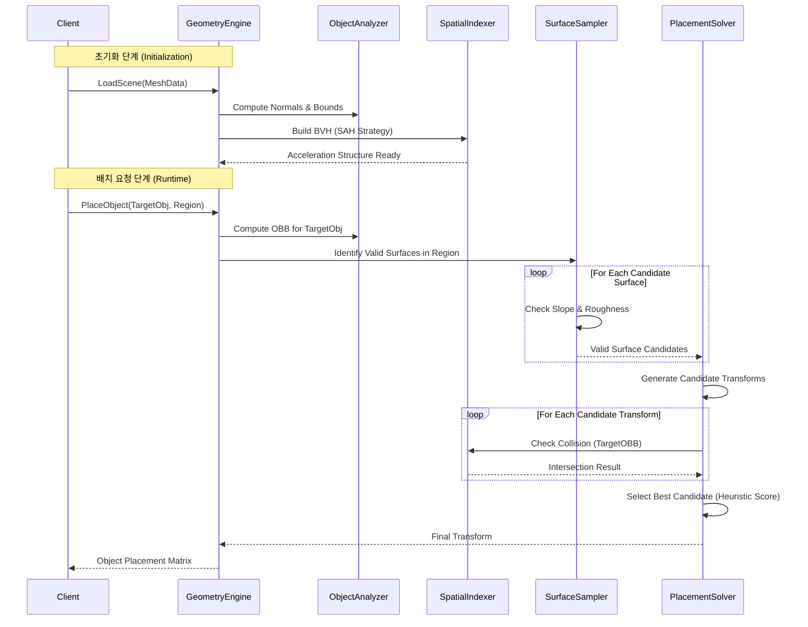

# 기술 설계 보고서: 오브젝트 배치 시스템 Phase A

## 핵심 기하 엔진 및 공간 분석 아키텍처

---

## 1. 서론

### 1.1 프로젝트 개요

본 문서는 '오브젝트 배치 시스템(Object Placement System)'의 초기 단계인 Phase A의 구현을 위한 포괄적인 기술 명세서 및 설계 보고서이다. 현대의 3D 애플리케이션, 특히 절차적 콘텐츠 생성(Procedural Content Generation) 및 시뮬레이션 환경에서 객체를 "자연스럽고", "물리적으로 타당하며", "의도에 부합하는" 위치에 자동으로 배치하는 것은 매우 복잡한 기하학적 연산을 요구한다.

Phase A의 주 목표는 이러한 배치를 가능하게 하는 **핵심 기하 엔진(Core Geometry Engine)**을 구축하는 것이다. 이는 단순히 좌표를 지정하는 것을 넘어, 3차원 공간의 위상(Topology)을 이해하고, 표면의 물리적 특성(Roughness, Slope)을 분석하며, 객체 간의 충돌을 밀리초(ms) 단위로 감지할 수 있는 고성능 연산 체계를 포함한다.

### 1.2 설계 목표 및 범위

본 시스템은 다음과 같은 핵심 요구사항을 충족하도록 설계된다.

1. **고성능 공간 분할 (Spatial Partitioning)**: 수만 개 이상의 폴리곤으로 구성된 씬(Scene)에서도 실시간 레이캐스팅(Raycasting)과 충돌 검사가 가능해야 한다. 이를 위해 표면적 휴리스틱(Surface Area Heuristic, SAH) 기반의 계층적 자료구조를 도입한다.

2. **정밀한 객체 분석 (Object Analysis)**: 임의의 메쉬 데이터로부터 객체의 주축(Principal Axes)을 추출하고, 이를 감싸는 최소 부피의 지향 경계 상자(OBB)를 생성한다. PCA 접근법과 Convex Hull 기반 보정 기법을 결합하여 대칭 객체에서의 분석 오류를 최소화한다.

3. **지능형 표면 분류 (Intelligent Surface Classification)**: 단순한 법선 벡터(Normal Vector) 분석을 넘어 표면의 거칠기(Roughness)와 평탄도(Planarity)를 분석하여 '배치 가능한 영역(Navigable Terrain)'을 수학적으로 정의한다.

4. **확장 가능한 아키텍처**: 향후 Phase B(AI 기반 맥락 인식)와 Phase C(동적 최적화) 확장을 고려하여, 데이터 흐름과 모듈 간 인터페이스를 유연하게 설계한다.

---

## 2. 시스템 아키텍처 (System Architecture)

시스템은 데이터의 생명 주기에 따라 크게 **오프라인 전처리 레이어(Offline Preprocessing Layer)**와 **런타임 쿼리 레이어(Runtime Query Layer)**로 구분된다.

### 2.1 모듈 구성도 (Module Composition)

```mermaid
classDiagram
    class GeometryEngine {
        +LoadMesh(data: MeshData)
        +BuildAccelerationStructure()
        +AnalyzeObjectFeatures(obj: GameObject)
        +FindPlacement(constraints: PlacementConstraints)
    }

    class SpatialIndexer {
        -Node* root
        -Strategy splitStrategy
        +Construct(primitives: List~Triangle~)
        +QueryRay(ray: Ray) HitResult
        +QueryVolume(obb: OBB) bool
    }

    class BVHBuilder {
        +BuildSAH(primitives: List~Triangle~) Node*
        -EvaluateSplitCost(left: AABB, right: AABB) float
    }

    class ObjectAnalyzer {
        +ComputeOBB(mesh: Mesh) OBB
        +ComputeConvexHull(points: List~Vector3~) Hull
        +ExtractFeatures(mesh: Mesh) FeatureSet
    }

    class SurfaceSampler {
        +ScanTerrain(region: AABB) List~SurfacePatch~
        +CheckRoughness(point: Vector3, radius: float) float
        +ClassifySurface(normal: Vector3) SurfaceType
    }

    class PlacementSolver {
        +Solve(request: Request) Transform
        -ValidateConstraints(t: Transform) bool
        -OptimizePosition(candidates: List~Vector3~) Vector3
    }

    GeometryEngine *-- SpatialIndexer
    GeometryEngine *-- ObjectAnalyzer
    GeometryEngine *-- SurfaceSampler
    GeometryEngine *-- PlacementSolver
    SpatialIndexer ..> BVHBuilder : uses
    PlacementSolver --> SpatialIndexer : queries collision
    PlacementSolver --> SurfaceSampler : queries terrain
```



### 2.2 데이터 처리 파이프라인 (Processing Pipeline)



---

## 3. 공간 분할 및 가속화 구조 (Spatial Partitioning)

3차원 공간 상에서의 연산 효율성은 공간 분할 전략에 의해 결정된다. 단순한 선형 탐색의 시간 복잡도는 $O(N)$이지만, 잘 구성된 계층적 구조를 사용할 경우 $O(\log N)$으로 단축될 수 있다.

### 3.1 BVH vs Octree vs BSP

| 특징 | BVH (Bounding Volume Hierarchy) | Octree | BSP (Binary Space Partitioning) |
|------|--------------------------------|--------|--------------------------------|
| 분할 방식 | 객체(Object) 중심 분할 | 공간(Space) 중심 균등 분할 | 평면(Plane) 기반 공간 분할 |
| 메모리 효율 | 높음 (빈 공간 노드 없음) | 중간 (빈 노드 발생 가능) | 낮음 (노드 수 증가 가능) |
| 동적 업데이트 | 비교적 용이 (Refitting 가능) | 어려움 | 매우 어려움 |
| 적합성 | **최적** (불규칙한 객체 배치) | 보통 (균일 분포 시 유리) | 보통 (실내 구조 등 정적 씬) |

### 3.2 표면적 휴리스틱 (Surface Area Heuristic, SAH) 이론

공간 분할의 효율성은 "임의의 광선(Ray)이 노드를 통과할 확률"을 최소화하는 것에 달려 있다. 기하학적 확률 이론에 따르면, 어떤 볼륨 $V$ 안에 포함된 볼륨 $A$를 임의의 광선이 타격할 확률 $P(A|V)$는 표면적의 비율에 비례한다.

$$P(hit|parent) \propto \frac{Area(child)}{Area(parent)}$$

비용 함수(Cost Function) $C$:

$$C(split) = K_T + K_I \left( \frac{Area(L)}{Area(P)} N_L + \frac{Area(R)}{Area(P)} N_R \right)$$

- $K_T$: 노드 순회(Traversal) 비용
- $K_I$: 프리미티브 교차(Intersection) 비용
- $Area(P), Area(L), Area(R)$: 부모, 왼쪽 자식, 오른쪽 자식 노드의 표면적
- $N_L, N_R$: 왼쪽, 오른쪽 자식 노드에 포함된 프리미티브(삼각형)의 개수

### 3.3 자료구조 설계 및 메모리 레이아웃

```cpp
// 32-byte 정렬을 통한 SIMD 최적화 및 캐시 효율 증대
struct alignas(32) LinearBVHNode {
    float aabbMin[3]; // 12 bytes
    int leftChildIdx; // 4 bytes (내부 노드일 경우) 또는 primitiveOffset (리프 노드일 경우)
    
    float aabbMax[3]; // 12 bytes
    int primCount;    // 4 bytes (0이면 내부 노드, >0이면 리프 노드)
    
    // Total: 32 bytes (정확히 캐시 라인의 절반, 한 번의 로드로 2개 노드 처리 가능)
};

// SIMD AABB 교차 검사를 위한 헬퍼 구조체
struct AABB_SIMD {
    __m128 min;
    __m128 max;
};
```

---

## 4. 오브젝트 분석 및 OBB 생성 (Object Analysis)

### 4.1 주성분 분석(PCA) 기반 접근법

점군(Point Cloud) 데이터의 공분산 행렬(Covariance Matrix)을 이용하면 객체의 주축을 추출할 수 있다.

**무게중심(Centroid) 계산:**

$$\mu = \frac{1}{N} \sum_{i=1}^{N} p_i$$

**공분산 행렬 구성 ($3 \times 3$):**

$$C_{jk} = \frac{1}{N} \sum_{i=1}^{N} (p_{i,j} - \mu_j)(p_{i,k} - \mu_k)$$

**고유값 분해 (Eigendecomposition):**

$$C v_k = \lambda_k v_k$$

이때 $v_1, v_2, v_3$는 OBB의 로컬 좌표축(Local Axes)이 되며, 서로 직교(Orthogonal)한다.

### 4.2 Convex Hull을 이용한 강건성 확보

PCA 방식의 문제점: 객체 내부의 정점 밀도가 불균일할 경우 주축이 편향됨.

**하이브리드 OBB 생성 알고리즘:**

```cpp
class OBBBuilder {
public:
    OBB Build(const Mesh& mesh) {
        // Step 1: Compute Convex Hull (Using Monotone Chain or QuickHull)
        std::vector<Vector3> hullPoints = ComputeConvexHull(mesh.vertices);
        
        // Step 2: Compute Covariance Matrix of Hull Points
        Matrix3x3 covariance = ComputeCovariance(hullPoints);
        
        // Step 3: Eigen Decomposition (Jacobi Method)
        Matrix3x3 eigenVectors;
        Vector3 eigenValues;
        SolveEigenSystem(covariance, eigenVectors, eigenValues);
        
        // Step 4: Optimize Axes (Rotating Calipers Variation)
        OBB bestOBB = FitOBB(hullPoints, eigenVectors);
        
        return bestOBB;
    }
};
```

---

## 5. 표면 분석 및 지형 분류 (Surface & Terrain Analysis)

### 5.1 법선 벡터 기반 경사도 필터링 (Slope Filtering)

$$\theta_{slope} = \arccos(\vec{n} \cdot \vec{up})$$

- $\vec{n}$: 표면의 단위 법선 벡터
- $\vec{up}$: 월드 좌표계의 상방 벡터 $(0, 1, 0)$

### 5.2 국소적 거칠기(Roughness) 추정

$$Roughness = \frac{1}{k} \sum_{i=1}^{k} dist(p_i, \Pi)^2$$

이 값이 임계값 $\epsilon$을 초과하면 해당 영역은 '거친 지형(Rough Terrain)'으로 분류되어 일반적인 물체 배치가 금지된다.

---

## 6. 레이캐스팅 및 교차 엔진 (Intersection Engine)

### 6.1 Ray-Box Intersection (Slab Method)

$$t_{enter} = \max(\min(t_{x1}, t_{x2}), \min(t_{y1}, t_{y2}), \min(t_{z1}, t_{z2}))$$
$$t_{exit} = \min(\max(t_{x1}, t_{x2}), \max(t_{y1}, t_{y2}), \max(t_{z1}, t_{z2}))$$

유효 교차 조건: $t_{enter} \le t_{exit}$ 그리고 $t_{exit} > 0$

### 6.2 Ray-Triangle Intersection (Möller–Trumbore)

$$\vec{O} + t\vec{D} = (1 - u - v)\vec{V}_0 + u\vec{V}_1 + v\vec{V}_2$$

---

## 7. 샘플링 및 유효성 검증 (Sampling & Validation)

### 7.1 포인트 인 메쉬(Point-in-Mesh) 검사

Ray Casting 기법(Jordan Curve Theorem의 3D 확장):

- 홀수(Odd): 내부 (Inside) - 충돌 발생, 배치 불가
- 짝수(Even): 외부 (Outside) - 배치 가능

### 7.2 가시성(Visibility)

$$Visibility(P) = \begin{cases} 1 & \text{if }!Intersect(Eye, P) \\ 0 & \text{otherwise} \end{cases}$$

---

## 8. 배치 솔버 및 휴리스틱 (Placement Solver)

### 8.1 비용 함수 (Cost Function) 설계

$$Cost(x) = w_1 \cdot D_{target}(x) + w_2 \cdot (1 - S_{flatness}(x)) + w_3 \cdot P_{collision}(x) + w_4 \cdot C_{semantic}(x)$$

- $D_{target}(x)$: 사용자가 원하는 목표 지점과의 거리
- $S_{flatness}(x)$: 표면의 평탄도 (법선 벡터와 Up 벡터의 내적)
- $P_{collision}(x)$: 충돌 페널티 (충돌 시 무한대)
- $C_{semantic}(x)$: Phase B에서 추가될 의미론적 비용

### 8.2 후보군 탐색 알고리즘

1. **초기 파종(Seeding)**: Poisson Disk Sampling으로 균일하게 후보 점 생성
2. **유효성 필터링**: 표면 법선, 거칠기 검사
3. **OBB 검사**: BVH를 통해 충돌 검사
4. **점수 평가 및 선택**: 비용 함수가 가장 낮은 상위 $K$개 반환

### 8.3 시스템 통합 코드

```cpp
std::optional<Matrix4x4> PlaceObject(
    const GeometryEngine& engine,
    const Mesh& objectMesh,
    const AABB& targetRegion
) {
    // 1. 객체 분석
    OBB objOBB = engine.Analyzer().ComputeOBB(objectMesh);
    
    // 2. 지형 스캔 (SAH BVH 활용)
    std::vector<SurfaceHit> surfaces = engine.Sampler().ScanSurfaces(targetRegion);
    
    // 3. 후보군 평가 (병렬 처리)
    std::vector<PlacementCandidate> candidates;
    
    #pragma omp parallel for
    for (const auto& surf : surfaces) {
        if (!IsValidSlope(surf.normal)) continue;
        if (engine.Sampler().CheckRoughness(surf.point) > THRESHOLD) continue;
        
        Matrix4x4 transform = MakeTransform(surf.point, surf.normal, objOBB);
        
        // 4. 충돌 검사
        OBB transformedOBB = TransformOBB(objOBB, transform);
        if (!engine.SpatialIndex().CheckCollision(transformedOBB)) {
            #pragma omp critical
            candidates.push_back({transform, CalculateScore(surf)});
        }
    }
    
    if (candidates.empty()) return std::nullopt;
    
    // 5. 최적 해 선택
    std::sort(candidates.begin(), candidates.end(), CompareScore);
    return candidates[0].transform;
}
```

---

## 9. 결론 및 향후 계획

### 9.1 요약

본 보고서는 3D 공간 내 자동 객체 배치를 위한 Phase A 시스템의 기술적 기반을 수립하였다.

- **SAH BVH**를 통해 대규모 씬에서의 실시간 공간 쿼리 성능 확보
- **Hybrid OBB 알고리즘**을 통해 객체의 형상을 정밀하게 근사
- **Möller–Trumbore 및 Slab Method**를 통한 고속 교차 연산 체계 설계
- **표면 분석(Surface Analysis)**을 통해 물리적으로 타당한 배치 영역 식별

### 9.2 Phase B/C 로드맵

- **Phase B (Semantic Awareness)**: 형상 유사도 분석 확장, "의자"는 "책상" 근처에 배치 등 규칙 학습
- **Phase C (Dynamic Optimization)**: Swarm Intelligence 기법으로 다수 객체 동시 배치 최적화

---

> **작성일**: 2026-01-29  
> **버전**: 1.0  
> **상태**: ✅ Approved
