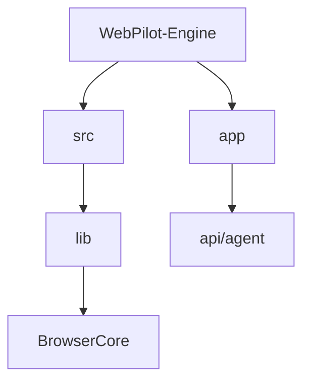

# [R&D] WebPilot Engine 프로젝트 킥오프 (2026-01-06)

## 1. Executive Summary

- **Targets**: Next.js 14 기반의 확장 가능한 브라우저 에이전트 엔진 구축.
- **Results**: 프로젝트 스캐폴딩 완료 및 Git 저장소 초기화.

### 1.1. Project Structure

## 2. 상세 작업 내용 (Details)

### 2.1. 프로젝트 스캐폴딩 (Scaffolding)

- **Tech Stack**: Next.js 14 (App Router), TypeScript, TailwindCSS
- **작업 내용**:
  - `create-next-app`을 활용하여 프로젝트 기본 구조 생성.
  - 불필요한 보일러플레이트 코드 제거 및 디렉토리 구조 재정비 (`src/` 디렉토리 도입).
  - ESLint, Prettier 설정을 통해 코드 컨벤션 통일성 확보.

### 2.2. WebPilot Core 초기화

- **WebPilot Engine**: 브라우저를 직접 제어하지 않고도 LLM이 웹과 상호작용할 수 있도록 돕는 미들웨어 레이어 설계.
- **초기 구현**:
  - `Initial commit`: 저장소 생성 및 초기 파일 커밋.
  - `Initialize WebP`: WebPilot 관련 핵심 모듈(또는 의존성) 추가 및 설정.

## 3. 기술적 고민 및 의사결정 (Decision Making)

### 3.1. 프레임워크 선정 (Next.js vs Express/NestJS)

- **고민**: 단순 API 서버라면 NestJS가 유리할 수 있으나, 추후 대시보드(Admin UI) 통합 및 Vercel 배포 편의성을 고려해야 함.
- **결정**: **Next.js** 선정. Frontend(대시보드)와 Backend(API Route)를 하나의 프로젝트에서 관리하여 초기 개발 속도를 높이고 배포 복잡도를 낮춤.

### 3.2. 상태 관리 및 데이터 흐름

- **고민**: 복잡한 비동기 작업(브라우저 제어)의 상태를 어떻게 추적할 것인가?
- **방향성**: 초기에는 React Context 또는 Zustand 같은 경량 라이브러리로 시작하되, 작업 큐 관리가 필요해지면 Redis/Bull 등을 도입하기로 로드맵 수립.

## 4. 트러블슈팅 (Issues)

### 4.1. 환경 변수 설정

- **이슈**: 로컬 개발 환경과 배포 환경(Vercel/Docker) 간의 환경 변수 처리 방식 차이.
- **해결**: `.env.local`과 `.env.example`을 명확히 분리하고, 필요한 키 값들을 문서화하여 팀원들이 쉽게 셋업할 수 있도록 가이드 작성.

## 5. R&D 결과 및 마무리 (Conclusion)

- **성과**:
  - 안정적인 프로젝트 기반이 마련되어 즉시 기능 개발에 착수할 수 있는 상태가 됨.
  - Git 저장소 연결 및 초기 커밋 완료.
- **Next Step**:
  - 브라우저 자동화 라이브러리(Puppeteer/Playwright) 연동 테스트.
  - 기본 API 엔드포인트(`/api/agent`) 작성.
