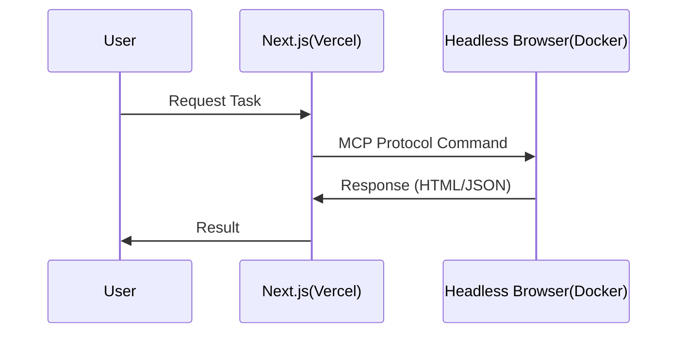

# [R&D] WebPilot Engine 아키텍처 및 Vercel 배포 환경 구성 (2026-01-09)

## 1. Executive Summary

- **Targets**: LLM-Browser 통신 규격(MCP) 연구 및 Serverless 배포 한계 극복.
- **Decision**: Vercel(Frontend) + Docker(Engine) 하이브리드 아키텍처 채택.

### 1.1. Hybrid Architecture

## 2. 상세 연구 및 배포 (Details & Deployment)

### 2.1. Vercel 배포 환경 셋업 (Vercel Deployment)

- **Serverless Function Limit**:
  - Vercel의 Serverless Function은 용량(50MB) 및 실행 시간(10초~60초) 제한이 엄격함.
  - Headless Browser(Chromium) 바이너리를 포함하면 용량 제한을 초과하는 이슈 발생.
- **해결 전략 (Workaround)**:
  - `@sparticuz/chromium`과 같은 AWS Lambda용 경량화 패키지 도입 검토.
  - 배포 테스트: `vercel deploy` 명령을 통해 Git 연동 없이 임시 배포하여 Cold Start 시간 측정.

### 2.2. Headless Browser 기술 검토

- **비교 분석**:
  - **Puppeteer**: Chrome DevTools Protocol(CDP) 기반으로 가볍고 설정이 간편함.
  - **Playwright**: 강력하나 무거움.
- **의사결정 (Decision)**:
  - 로컬/Docker 환경에선 Playwright를 지향하되, Vercel 배포 시에는 Puppeteer Core + Remote Browser(Browserless.io 등) 연결 방식을 혼용하는 하이브리드 아키텍처 구상.

## 3. 환경 설정 및 준비 (Environment Setup)

- **Linter & Formatter**:
  - `eslint-config-next` 기반으로 엄격한 TypeScript 규칙 적용.
  - 협업 시 코드 일관성을 위해 Prettier의 `printWidth: 120`, `singleQuote: true` 등 세부 규칙 확정.

## 4. 인사이트 (Insights)

- **Serverless의 양면성**: 배포는 쉽지만, 브라우저 같은 무거운 의존성을 가진 앱에는 적합하지 않을 수 있다. 하이브리드 호스팅 전략(Vercel for Frontend, Docker for Engine)이 유력해보임.
