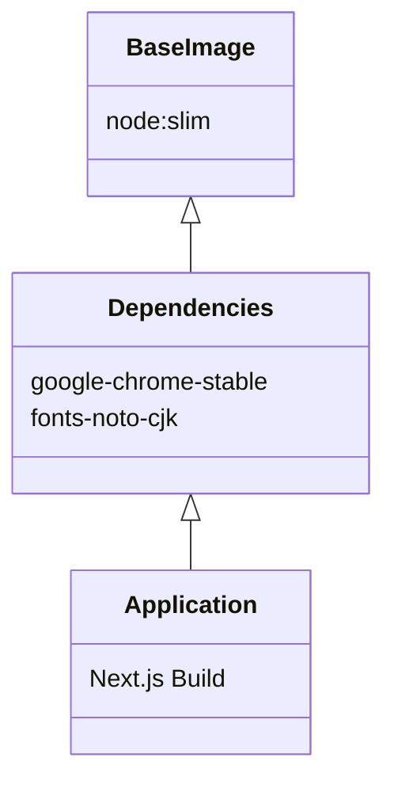

# [R&D] 컨테이너 기반 운영 환경 및 배포 검증 (2026-01-12)

## 1. Executive Summary

- **Targets**: 안정적인 Headless Browser 구동을 위한 Docker 환경 표준화.
- **Results**: 한글 폰트 이슈 해결 및 Staging 배포 성공.

### 1.1. Docker Layer Strategy

## 2. 상세 기획 및 검증 (Details & Verification)

### 2.1. Dockerization 전략

- **Challenge**: 로컬에선 잘 되는데 Vercel/Docker에선 폰트 깨짐이나 실행 불가(Crash) 현상 발생.
- **Strategy**:
  - `node:slim` 기반으로 필요한 패키지(`google-chrome-stable`, 한글 폰트 `fonts-noto-cjk`)를 레이어링.
  - Vercel 배포 실패 로그 분석: `Error: Failed to launch the browser process`. 의존성 패키지 누락 확인.

### 2.2. 배포 이력 점검 (Deployment Check)

- **Vercel Dashboard**:
  - 1월 9일 1차 배포 실패 후, `next.config.js`의 `serverComponentsExternalPackages` 옵션 조정.
  - 금일(12일) 스테이징 배포 성공. 단, API Latency가 평균 2초대로 높아 최적화 필요.
- **Sandbox Security**:
  - `--no-sandbox` 옵션 사용을 최소화하고, 리소스 제한(Quota) 정책 수립.

## 3. 문서화 및 표준 (Standardization)

- **TypeScript Configuration**:
  - `tsconfig.json` 외에 스크립트 실행을 위한 `tsconfig.scripts.json` 분리 전략 구상.

## 4. 인사이트 (Insights)

- **Shift Left**: 배포 단계에서 터질 문제를 미리 개발 단계(Dockerfile 설계)에서 고민하는 것이 비용을 줄이는 길이다.
- **Logs**: 배포 환경의 로그는 로컬과 다르다. 구조화된 로깅(Structured Logging)이 필수적이다.
