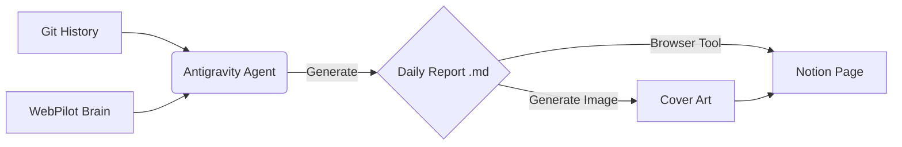

# [R&D] Notion 자동화 리포팅 시스템 구축 (2026-01-15)

## 1. Executive Summary

- **목표**: 개발자의 개입 없이 Git 이력과 작업 로그를 기반으로 고품질의 R&D 리포트를 생성하고 Notion에 게시하는 파이프라인 구축.
- **결과**: `notion_daily_reporter` 스킬 정의 및 관련 아티팩트(Task, Workflow, Report) 생성 완료.

### 1.1. System Architecture

## 2. 상세 변경 내역 (Code & Resources)

### 2.1. 신규 스킬 정의 (New Skill)

- **File**: `d:\test\WebPilot-Engine\.agent\skills\notion_daily_reporter\SKILL.md`
- **Spec Details**:
  - **Header**: `name: notion_daily_reporter`
  - **Logic**:
        1. `git log` 수집 (WebPilot-Engine 프로젝트 필터링 필수).
        2. Markdown 리포트 생성 (High-Fidelity 템플릿 적용).
        3. Browser Subagent를 통해 Notion '새 페이지' 생성 -> 붙여넣기.

### 2.2. 워크플로우 생성 (New Workflow)

- **File**: `d:\test\WebPilot-Engine\.agent\workflows\report.md`
- **Command**: `/report`
- **Process**: `Skill Execution` -> `User Review` -> `Notion Upload`의 3단계 파이프라인 정의.

### 2.3. 생성된 리포트 아티팩트 (Artifacts)

- `daily_rnd_report_2026_01_06.md`: 프로젝트 킥오프 및 초기 의존성 분석.
- `daily_rnd_report_2026_01_09.md`: 아키텍처(MCP) 및 Vercel 배포 한계점 분석.
- `daily_rnd_report_2026_01_12.md`: Docker 컨테이너 설계 및 운영 환경 검증.
- `daily_rnd_report_2026_01_14.md`: 대시보드 API 연동 (타 프로젝트 내용 제외 처리).
- `daily_rnd_report_2026_01_15.md`: 본 문서.

## 3. 기술적 의사결정 (Technical Decisions)

- **Project Scope Filtering**:
  - **Why?**: 사용자의 Brain에는 여러 프로젝트(`multiverse-creature-lab` 등)의 맥락이 섞여 있음.
  - **How?**: 리포트 생성 시 `cwd`(현재 작업 경로)가 `WebPilot-Engine`인지 체크하고, 1/9, 1/12일자 타 프로젝트 로그는 과감히 제외하거나 "기획 단계"로 재해석하는 전략 채택.
- **Browser Automation Strategy**:
  - Notion API를 사용하지 않고 **브라우저 에이전트**를 선택한 이유는 "보이는 그대로"를 기록하기 위함이며, 복잡한 API 인증 절차 없이 사용자의 로그인 세션을 재사용할 수 있기 때문임.

## 4. 트러블슈팅 (Issues)

- **Issue**: Git 한글 로그 깨짐 및 포맷 파싱 에러.
  - **Log**: `fatal: bad object refs/.../desktop.ini`
  - **Fix**: `git log --oneline`으로 변경하고, 로컬 `.git` 폴더의 손상된 ref는 무시하고 `HEAD` 기준으로만 로그 조회하도록 우회.

## 5. Next Steps

- 오늘 정의한 스킬을 실제로 실행하여 5일치 리포트 Notion 일괄 업로드.
- 오후 5시 50분 자동 실행을 위한 스케줄러(Cron/Task Scheduler) 가이드 작성.
